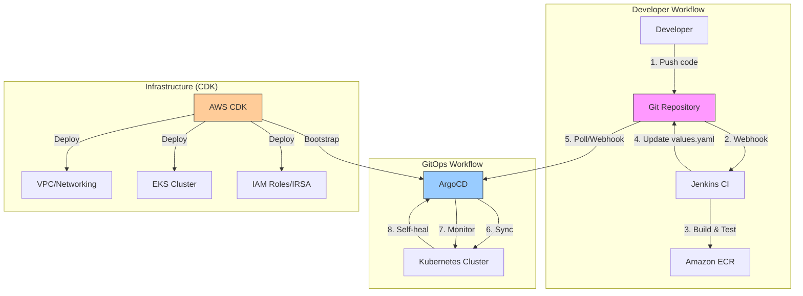

# Design Document: ArgoCD GitOps Migration

## Overview

This design specifies the migration from CDK-based Kubernetes workload deployment to a GitOps approach using ArgoCD and Helm charts. The migration maintains all existing AWS infrastructure while transitioning workload management to industry-standard GitOps practices.

### Current State

- Two EKS clusters (Jenkins and nginx-api) with workloads deployed via CDK `cluster.addManifest()`
- All infrastructure (VPC, EKS, networking, IAM) managed by CDK
- Direct CDK deployment of Kubernetes manifests
- No Helm charts or GitOps tooling

### Target State

- Same two EKS clusters with infrastructure unchanged
- ArgoCD installed on each cluster (bootstrapped by CDK)
- All workloads deployed via Helm charts managed by ArgoCD
- Git as single source of truth for workload configuration
- Hybrid approach: CDK for infrastructure, ArgoCD for workloads

### Migration Benefits

1. **Learning**: Hands-on experience with Helm and GitOps (industry standards)
2. **Declarative**: Git represents desired state, ArgoCD ensures actual state matches
3. **Visibility**: ArgoCD UI shows deployment status and drift detection
4. **Rollback**: Easy rollback via Git history
5. **Separation**: Clear boundary between infrastructure (CDK) and workloads (ArgoCD)

## Architecture

### High-Level Architecture




### Responsibility Boundaries

**CDK Manages:**
- VPC, subnets, routing, Transit Gateway
- EKS cluster control plane and node groups
- IAM roles and service accounts (IRSA)
- EFS file systems and storage
- Security groups and network policies
- ArgoCD installation (bootstrap only)
- Secrets in AWS Secrets Manager

**ArgoCD Manages:**
- Application deployments (Jenkins, nginx-api)
- Platform services (AWS Load Balancer Controller)
- Kubernetes ConfigMaps and application-level secrets
- Ingress resources
- Application scaling and updates

**Git Repository Structure:**
```
eks_jenkins/
├── lib/                          # CDK infrastructure code (unchanged)
├── bin/                          # CDK app entry point (unchanged)
├── platform/                     # Platform Helm charts (NEW)
│   └── aws-load-balancer-controller/
│       ├── Chart.yaml
│       └── values.yaml
├── deploy/                       # Application Helm charts (NEW)
│   ├── jenkins/
│   │   └── values.yaml          # Custom values for jenkins/jenkins chart
│   └── nginx-api/
│       └── (existing nginx-api-chart moved here)
├── argocd-apps/                  # ArgoCD Application manifests (NEW)
│   ├── jenkins-alb-controller.yaml
│   ├── jenkins-app.yaml
│   ├── nginx-alb-controller.yaml
│   └── nginx-api-app.yaml
└── k8s/                          # Legacy manifests (will be deprecated)
```

## Components and Interfaces

### Component 1: ArgoCD Bootstrap Stacks

**Purpose:** Install ArgoCD on each EKS cluster using CDK

**Jenkins ArgoCD Stack:**
```typescript
export class JenkinsArgoCDStack extends cdk.Stack {
  constructor(scope: Construct, id: string, props: JenkinsArgoCDStackProps) {
    // Install ArgoCD using Helm chart
    const argoCDChart = props.cluster.addHelmChart('ArgoCD', {
      chart: 'argo-cd',
      repository: 'https://argoproj.github.io/argo-helm',
      namespace: 'argocd',
      createNamespace: true,
      values: {
        server: {
          service: {
            type: 'ClusterIP'  // Use ALB, not LoadBalancer
          }
        }
      }
    });
    
    // Create Ingress for ArgoCD UI
    const argoCDIngress = props.cluster.addManifest('ArgoCDIngress', {
      apiVersion: 'networking.k8s.io/v1',
      kind: 'Ingress',
      metadata: {
        name: 'argocd-server',
        namespace: 'argocd',
        annotations: {
          'alb.ingress.kubernetes.io/scheme': 'internet-facing',
          'alb.ingress.kubernetes.io/target-type': 'ip',
          'alb.ingress.kubernetes.io/backend-protocol': 'HTTPS',
          'alb.ingress.kubernetes.io/listen-ports': '[{"HTTPS":443}]',
          'alb.ingress.kubernetes.io/security-groups': props.albSecurityGroup.securityGroupId
        }
      },
      spec: {
        ingressClassName: 'alb',
        rules: [{
          http: {
            paths: [{
              path: '/',
              pathType: 'Prefix',
              backend: {
                service: {
                  name: 'argocd-server',
                  port: { number: 443 }
                }
              }
            }]
          }
        }]
      }
    });
  }
}
```


**Nginx API ArgoCD Stack:**
- Similar structure to Jenkins ArgoCD Stack
- Separate ArgoCD instance for nginx-api cluster
- Own ALB Ingress with security group

**Dependencies:**
- Requires EKS cluster to exist
- Requires ALB Controller to be installed (chicken-egg: solve by manual first install or CDK manifest)
- Requires ALB security group from network stack

### Component 2: Platform Helm Charts

**AWS Load Balancer Controller Chart:**

Location: `platform/aws-load-balancer-controller/`

Chart.yaml:
```yaml
apiVersion: v2
name: aws-load-balancer-controller
description: Wrapper chart for AWS Load Balancer Controller
type: application
version: 1.0.0
dependencies:
  - name: aws-load-balancer-controller
    version: 1.8.1
    repository: https://aws.github.io/eks-charts
```

values.yaml:
```yaml
aws-load-balancer-controller:
  clusterName: jenkins-eks-cluster  # or nginx-api-cluster
  serviceAccount:
    create: false  # CDK creates this with IRSA
    name: aws-load-balancer-controller
  region: us-west-2
  vpcId: vpc-xxxxx  # Injected by ArgoCD Application
```

**Key Design Decision:** CDK continues to create the service account with IRSA. Helm chart only deploys the controller deployment, not the service account. This maintains the "no placeholders" philosophy.

### Component 3: Jenkins Helm Chart Configuration

**Location:** `deploy/jenkins/values.yaml`

**Strategy:** Use official `jenkins/jenkins` Helm chart with custom values


Key values to configure:
```yaml
controller:
  serviceAccount:
    create: false
    name: jenkins-controller  # CDK-created with IRSA
  
  persistence:
    enabled: true
    existingClaim: jenkins-home-pvc  # CDK-created PVC pointing to EFS
  
  ingress:
    enabled: false  # CDK manages Ingress separately for now
  
  installPlugins:
    - kubernetes:4360.v0e4b_1c40e9e5
    - workflow-aggregator:600.vb_57cdd26fdd7
    # ... (migrate from current ConfigMap)
  
  JCasC:
    configScripts:
      # Migrate from current jcasc-main-configmap.yaml
```

**Migration Path:**
1. Extract current plugin list from `k8s/jenkins/plugins-configmap.yaml`
2. Extract current JCasC from `k8s/jenkins/jcasc-main-configmap.yaml`
3. Convert to Helm values format
4. Keep PVC and service account managed by CDK (no change)

### Component 4: Nginx-API Helm Chart

**Location:** `deploy/nginx-api/` (move existing `nginx-api-chart/`)

**Updates needed:**
```yaml
# values.yaml
image:
  repository: ${AWS_ACCOUNT_ID}.dkr.ecr.${AWS_REGION}.amazonaws.com/nginx-api
  tag: latest
  pullPolicy: IfNotPresent

# Use template function to inject account/region
# Or use ArgoCD Application to override values
```

**Template Updates:**
- Ensure all templates use `.Values` correctly
- Add helpers for common labels
- Parameterize all hardcoded values

### Component 5: ArgoCD Application Manifests

**Jenkins ALB Controller Application:**
```yaml
apiVersion: argoproj.io/v1alpha1
kind: Application
metadata:
  name: aws-load-balancer-controller
  namespace: argocd
spec:
  project: default
  source:
    repoURL: https://github.com/your-org/eks_jenkins.git
    targetRevision: main
    path: platform/aws-load-balancer-controller
    helm:
      values: |
        aws-load-balancer-controller:
          clusterName: jenkins-eks-cluster
          vpcId: vpc-xxxxx
  destination:
    server: https://kubernetes.default.svc
    namespace: kube-system
  syncPolicy:
    automated:
      prune: true
      selfHeal: true
    syncOptions:
      - CreateNamespace=false
```

**Jenkins Application:**
```yaml
apiVersion: argoproj.io/v1alpha1
kind: Application
metadata:
  name: jenkins
  namespace: argocd
spec:
  project: default
  source:
    repoURL: https://charts.jenkins.io
    chart: jenkins
    targetRevision: 5.1.0
    helm:
      valueFiles:
        - https://raw.githubusercontent.com/your-org/eks_jenkins/main/deploy/jenkins/values.yaml
  destination:
    server: https://kubernetes.default.svc
    namespace: jenkins
  syncPolicy:
    automated:
      prune: true
      selfHeal: true
    syncOptions:
      - CreateNamespace=false
```

**Nginx-API Application:**
```yaml
apiVersion: argoproj.io/v1alpha1
kind: Application
metadata:
  name: nginx-api
  namespace: argocd
spec:
  project: default
  source:
    repoURL: https://github.com/your-org/eks_jenkins.git
    targetRevision: main
    path: deploy/nginx-api
  destination:
    server: https://kubernetes.default.svc
    namespace: nginx-api
  syncPolicy:
    automated:
      prune: true
      selfHeal: true
```


## Data Models

### ArgoCD Application Resource

```yaml
apiVersion: argoproj.io/v1alpha1
kind: Application
metadata:
  name: string              # Application name
  namespace: argocd         # Always argocd namespace
  finalizers:
    - resources-finalizer.argocd.argoproj.io  # Cleanup on delete
spec:
  project: string           # ArgoCD project (default: "default")
  source:
    repoURL: string         # Git repo or Helm repo URL
    targetRevision: string  # Branch, tag, or chart version
    path: string            # Path within repo (for Git)
    chart: string           # Chart name (for Helm repo)
    helm:
      valueFiles: []        # List of values files
      values: string        # Inline values (YAML string)
      parameters: []        # Key-value overrides
  destination:
    server: string          # K8s API server URL
    namespace: string       # Target namespace
  syncPolicy:
    automated:
      prune: boolean        # Delete resources not in Git
      selfHeal: boolean     # Revert manual changes
    syncOptions: []         # Additional sync options
```

### Helm Chart Structure

```
chart-name/
├── Chart.yaml              # Chart metadata
├── values.yaml             # Default values
├── templates/              # Kubernetes manifest templates
│   ├── _helpers.tpl       # Template helpers
│   ├── deployment.yaml
│   ├── service.yaml
│   ├── ingress.yaml
│   └── NOTES.txt          # Post-install notes
└── charts/                 # Dependency charts (optional)
```

### Chart.yaml Schema

```yaml
apiVersion: v2              # Helm 3
name: string                # Chart name
description: string         # Chart description
type: application           # application or library
version: string             # Chart version (SemVer)
appVersion: string          # Application version
dependencies: []            # Chart dependencies
  - name: string
    version: string
    repository: string
```

### Values File Structure

```yaml
# Global values (available to all templates)
global:
  region: us-west-2
  accountId: "123456789012"

# Component-specific values
image:
  repository: string
  tag: string
  pullPolicy: string

service:
  type: string
  port: number

resources:
  requests:
    cpu: string
    memory: string
  limits:
    cpu: string
    memory: string
```

## Correctness Properties

*A property is a characteristic or behavior that should hold true across all valid executions of a system—essentially, a formal statement about what the system should do. Properties serve as the bridge between human-readable specifications and machine-verifiable correctness guarantees.*


### Property Reflection

After analyzing all acceptance criteria, most are configuration verification examples or documentation requirements. The key properties that provide unique validation value are:

1. **Repository Structure Completeness**: Verify all required directories and files exist
2. **Configuration Consistency**: Verify migrated configurations match original configurations
3. **Template Correctness**: Verify Helm templates use values correctly
4. **Infrastructure Preservation**: Verify CDK stacks remain unchanged
5. **GitOps Workflow**: Verify Git changes trigger ArgoCD syncs

Many individual criteria (like checking specific annotations) can be combined into comprehensive properties that validate entire configurations rather than individual fields.

### Correctness Properties

**Property 1: Repository Structure Completeness**

*For any* valid migration, the repository SHALL contain all required directories (platform/, deploy/, argocd-apps/) with their expected subdirectories and files, and the existing lib/ directory SHALL remain unchanged.

**Validates: Requirements 3.1, 3.2, 3.3, 3.4, 3.5, 3.6, 3.8**

**Property 2: ArgoCD Bootstrap Correctness**

*For any* EKS cluster (Jenkins or nginx-api), after CDK deployment, the argocd namespace SHALL exist, contain running ArgoCD pods, have a ClusterIP service, and have an Ingress with correct ALB annotations including the security group reference.

**Validates: Requirements 1.1, 1.2, 1.4, 1.5, 1.6, 2.1, 2.2, 2.3, 2.4**

**Property 3: Plugin Configuration Migration Completeness**

*For any* plugin in the original Jenkins plugins ConfigMap, that plugin SHALL appear in the migrated values.yaml installPlugins list with the same or newer version.

**Validates: Requirements 5.5**

**Property 4: JCasC Configuration Migration Completeness**

*For any* JCasC configuration section in the original ConfigMap, an equivalent configuration SHALL exist in the migrated values.yaml JCasC.configScripts section.

**Validates: Requirements 5.6**

**Property 5: Helm Template Value References**

*For any* Helm template file (deployment.yaml, service.yaml, ingress.yaml), all hardcoded values SHALL be replaced with .Values references, and all referenced values SHALL exist in values.yaml.

**Validates: Requirements 6.5**

**Property 6: Infrastructure Stack Preservation**

*For any* infrastructure CDK stack (JenkinsNetworkStack, NginxApiNetworkStack, JenkinsStorageStack, TransitGatewayStack, JenkinsEksClusterStack, JenkinsEksNodeGroupsStack), the stack code SHALL remain unchanged after migration, and all resources SHALL continue to exist.

**Validates: Requirements 11.1, 11.2, 11.3, 11.4, 11.5, 11.6, 11.7, 11.8, 11.9**

**Property 7: ArgoCD Application Configuration Correctness**

*For any* ArgoCD Application manifest, it SHALL have a valid source (repoURL, path/chart, targetRevision), a valid destination (server, namespace), and automated syncPolicy with prune and selfHeal enabled.

**Validates: Requirements 7.5, 7.6, 7.7, 7.8, 7.9**

**Property 8: Service Account Reference Consistency**

*For any* Helm chart (ALB Controller, Jenkins), if serviceAccount.create is false, then serviceAccount.name SHALL reference an existing CDK-created service account, and that service account SHALL have an IAM role with IRSA annotation.

**Validates: Requirements 4.4, 4.5, 5.4**

**Property 9: Secrets Not in Git**

*For any* file in the Git repository, it SHALL NOT contain sensitive values (passwords, tokens, private keys), and all sensitive data SHALL be referenced via secretKeyRef or external secret management.

**Validates: Requirements 17.1, 17.2**

**Property 10: GitOps Sync Workflow**

*For any* change to a Helm chart or values file in Git, when committed to the main branch, ArgoCD SHALL detect the change within its poll interval and sync the application, resulting in updated resources in the cluster.

**Validates: Requirements 19.1, 19.3**

**Property 11: Application Health After Migration**

*For any* migrated application (Jenkins, nginx-api, ALB Controller), after ArgoCD sync completes, the application SHALL show Healthy status in ArgoCD UI, all pods SHALL be Running, and the application SHALL respond to health check requests.

**Validates: Requirements 14.3, 14.4, 14.5, 14.6, 14.7, 6.8**

**Property 12: CDK Workload Code Removal**

*For any* application migrated to ArgoCD (Jenkins, nginx-api, ALB Controller), the corresponding CDK stack SHALL NOT contain cluster.addManifest() calls for that application's Deployment, StatefulSet, or ConfigMap resources.

**Validates: Requirements 4.8, 5.9, 6.7**


## Error Handling

### ArgoCD Sync Failures

**Scenario:** ArgoCD fails to sync an application due to invalid Helm chart or values

**Handling:**
- ArgoCD retains previous working version
- Error message displayed in ArgoCD UI with details
- Application status shows "Degraded" or "OutOfSync"
- Manual intervention required to fix chart/values
- Rollback via Git revert

**Prevention:**
- Use `helm template` locally to validate charts before commit
- Use `helm lint` to catch common issues
- Enable ArgoCD pre-sync hooks for validation
- Use Git branch protection and PR reviews

### CDK Deployment Failures

**Scenario:** CDK deployment fails during ArgoCD bootstrap

**Handling:**
- CloudFormation automatically rolls back
- Previous stack version remains intact
- Error details in CloudFormation events
- Fix CDK code and redeploy

**Prevention:**
- Test CDK changes in dev environment first
- Use `cdk diff` to preview changes
- Deploy stacks incrementally (network → cluster → argocd)

### Helm Chart Rendering Errors

**Scenario:** Helm template contains syntax errors or invalid references

**Handling:**
- ArgoCD shows "ComparisonError" status
- Error message indicates template line number
- Application not synced until fixed
- Previous version continues running

**Prevention:**
- Use `helm template` to test rendering locally
- Use IDE with Helm/YAML validation
- Include template tests in CI pipeline

### Missing Dependencies

**Scenario:** ArgoCD Application references non-existent resources (PVC, ServiceAccount, Secret)

**Handling:**
- ArgoCD shows "Missing" or "Progressing" status
- Pods fail to start with clear error messages
- Manual creation of missing resources required
- Or update CDK to create missing resources

**Prevention:**
- Document all CDK-managed resources
- Verify dependencies before creating ArgoCD Applications
- Use ArgoCD sync waves to control deployment order

### Security Group Misconfigurations

**Scenario:** ALB cannot reach pods due to security group rules

**Handling:**
- ALB health checks fail
- Ingress shows unhealthy targets
- Check security group rules in AWS console
- Update CDK security group configuration

**Prevention:**
- Maintain existing security group patterns
- Test connectivity after each migration phase
- Document required security group rules

### Secrets Not Found

**Scenario:** Application references Kubernetes secret that doesn't exist

**Handling:**
- Pods fail to start with "secret not found" error
- ArgoCD shows "Degraded" status
- Create secret manually via kubectl
- Or update CDK to create secret

**Prevention:**
- Document all required secrets
- Verify secrets exist before deploying applications
- Use external secret management (future enhancement)

## Testing Strategy

### Dual Testing Approach

This migration requires both **unit tests** and **integration tests** to ensure correctness:

**Unit Tests:**
- Validate Helm chart templates render correctly
- Verify values.yaml has required fields
- Check ArgoCD Application manifests are valid YAML
- Verify CDK stacks synthesize without errors

**Integration Tests:**
- Deploy to test environment and verify end-to-end functionality
- Test ArgoCD sync workflow (git push → sync → cluster update)
- Verify applications respond to health checks
- Test rollback procedures

### Property-Based Testing

For properties that can be validated programmatically, use property-based testing with minimum 100 iterations:

**Property Test 1: Repository Structure**
```typescript
// Feature: argocd-gitops-migration, Property 1: Repository Structure Completeness
describe('Repository Structure', () => {
  it('should have all required directories and files', () => {
    const requiredDirs = [
      'platform/aws-load-balancer-controller',
      'deploy/jenkins',
      'deploy/nginx-api',
      'argocd-apps',
      'lib'  // existing
    ];
    
    requiredDirs.forEach(dir => {
      expect(fs.existsSync(dir)).toBe(true);
    });
    
    const requiredFiles = [
      'platform/aws-load-balancer-controller/Chart.yaml',
      'platform/aws-load-balancer-controller/values.yaml',
      'deploy/jenkins/values.yaml',
      'argocd-apps/jenkins-alb-controller.yaml',
      'argocd-apps/jenkins-app.yaml',
      'argocd-apps/nginx-alb-controller.yaml',
      'argocd-apps/nginx-api-app.yaml'
    ];
    
    requiredFiles.forEach(file => {
      expect(fs.existsSync(file)).toBe(true);
    });
  });
});
```

**Property Test 2: Helm Template Validation**
```typescript
// Feature: argocd-gitops-migration, Property 5: Helm Template Value References
describe('Helm Template Validation', () => {
  it('should render without errors and use .Values correctly', () => {
    const charts = ['deploy/nginx-api'];
    
    charts.forEach(chartPath => {
      // Run helm template command
      const result = execSync(`helm template test ${chartPath}`);
      expect(result).toBeDefined();
      
      // Check that no hardcoded values remain
      const templates = fs.readdirSync(`${chartPath}/templates`);
      templates.forEach(template => {
        const content = fs.readFileSync(`${chartPath}/templates/${template}`, 'utf8');
        // Should not contain hardcoded account IDs, regions, etc.
        expect(content).not.toMatch(/\d{12}/);  // AWS account ID pattern
        expect(content).not.toMatch(/us-west-2/);  // Hardcoded region
      });
    });
  });
});
```

**Property Test 3: ArgoCD Application Validation**
```typescript
// Feature: argocd-gitops-migration, Property 7: ArgoCD Application Configuration Correctness
describe('ArgoCD Application Manifests', () => {
  it('should have valid configuration', () => {
    const appFiles = fs.readdirSync('argocd-apps');
    
    appFiles.forEach(file => {
      const content = fs.readFileSync(`argocd-apps/${file}`, 'utf8');
      const app = yaml.load(content);
      
      // Validate required fields
      expect(app.apiVersion).toBe('argoproj.io/v1alpha1');
      expect(app.kind).toBe('Application');
      expect(app.spec.source.repoURL).toBeDefined();
      expect(app.spec.destination.server).toBe('https://kubernetes.default.svc');
      expect(app.spec.destination.namespace).toBeDefined();
      
      // Validate sync policy
      expect(app.spec.syncPolicy.automated.prune).toBe(true);
      expect(app.spec.syncPolicy.automated.selfHeal).toBe(true);
    });
  });
});
```

**Integration Test 1: ArgoCD Bootstrap**
```typescript
// Feature: argocd-gitops-migration, Property 2: ArgoCD Bootstrap Correctness
describe('ArgoCD Bootstrap', () => {
  it('should install ArgoCD correctly on both clusters', async () => {
    const clusters = ['jenkins-eks-cluster', 'nginx-api-cluster'];
    
    for (const cluster of clusters) {
      // Update kubeconfig
      execSync(`aws eks update-kubeconfig --name ${cluster} --region us-west-2`);
      
      // Check namespace exists
      const ns = execSync('kubectl get namespace argocd -o json');
      expect(JSON.parse(ns.toString())).toBeDefined();
      
      // Check ArgoCD pods are running
      const pods = execSync('kubectl get pods -n argocd -o json');
      const podList = JSON.parse(pods.toString());
      expect(podList.items.length).toBeGreaterThan(0);
      podList.items.forEach(pod => {
        expect(pod.status.phase).toBe('Running');
      });
      
      // Check Ingress exists with correct annotations
      const ingress = execSync('kubectl get ingress argocd-server -n argocd -o json');
      const ingressObj = JSON.parse(ingress.toString());
      expect(ingressObj.spec.ingressClassName).toBe('alb');
      expect(ingressObj.metadata.annotations['alb.ingress.kubernetes.io/scheme']).toBe('internet-facing');
    }
  });
});
```

**Integration Test 2: Application Health**
```typescript
// Feature: argocd-gitops-migration, Property 11: Application Health After Migration
describe('Application Health', () => {
  it('should have all applications healthy after migration', async () => {
    const apps = [
      { cluster: 'jenkins-eks-cluster', name: 'jenkins', namespace: 'jenkins' },
      { cluster: 'nginx-api-cluster', name: 'nginx-api', namespace: 'nginx-api' }
    ];
    
    for (const app of apps) {
      execSync(`aws eks update-kubeconfig --name ${app.cluster} --region us-west-2`);
      
      // Check ArgoCD Application status
      const argoApp = execSync(`kubectl get application ${app.name} -n argocd -o json`);
      const argoAppObj = JSON.parse(argoApp.toString());
      expect(argoAppObj.status.health.status).toBe('Healthy');
      expect(argoAppObj.status.sync.status).toBe('Synced');
      
      // Check pods are running
      const pods = execSync(`kubectl get pods -n ${app.namespace} -o json`);
      const podList = JSON.parse(pods.toString());
      podList.items.forEach(pod => {
        expect(pod.status.phase).toBe('Running');
      });
      
      // Check health endpoint (if applicable)
      if (app.name === 'nginx-api') {
        const ingress = execSync(`kubectl get ingress ${app.name} -n ${app.namespace} -o json`);
        const ingressObj = JSON.parse(ingress.toString());
        const albUrl = ingressObj.status.loadBalancer.ingress[0].hostname;
        
        const response = await fetch(`http://${albUrl}/health`);
        expect(response.status).toBe(200);
      }
    }
  });
});
```

### Manual Testing Checklist

After each migration phase, manually verify:

**Phase 1 (ArgoCD Bootstrap):**
- [ ] ArgoCD UI accessible via ALB on both clusters
- [ ] Can login with admin credentials
- [ ] No applications shown (empty state)
- [ ] CDK outputs show correct URLs

**Phase 2 (Nginx-API Migration):**
- [ ] nginx-api Application shows in ArgoCD UI
- [ ] Application status is Healthy and Synced
- [ ] nginx-api responds to /health endpoint
- [ ] ALB routes traffic correctly
- [ ] No downtime during migration

**Phase 3 (Jenkins Migration):**
- [ ] Jenkins Application shows in ArgoCD UI
- [ ] Application status is Healthy and Synced
- [ ] Jenkins UI accessible and functional
- [ ] Can run existing jobs successfully
- [ ] Persistent data intact (jobs, configuration)
- [ ] No downtime during migration

**Phase 4 (Cleanup):**
- [ ] Old CDK manifest code removed
- [ ] CDK stacks still deploy successfully
- [ ] No orphaned resources in clusters
- [ ] Documentation updated

### Testing Tools

- **Helm CLI**: For template validation and linting
- **kubectl**: For cluster resource verification
- **ArgoCD CLI**: For application management and sync testing
- **Jest/TypeScript**: For unit and integration tests
- **curl/Postman**: For API endpoint testing
- **AWS CLI**: For infrastructure verification

## Migration Phases

### Phase 1: ArgoCD Bootstrap (Low Risk)

**Goal:** Install ArgoCD on both clusters without affecting existing workloads

**Steps:**
1. Create JenkinsArgoCDStack in CDK
2. Create NginxApiArgoCDStack in CDK
3. Deploy both stacks: `cdk deploy JenkinsArgoCDStack NginxApiArgoCDStack`
4. Verify ArgoCD UI accessible on both clusters
5. Retrieve admin passwords and login

**Rollback:** Delete ArgoCD stacks if issues occur

**Duration:** 30-45 minutes

### Phase 2: Nginx-API Migration (Medium Risk)

**Goal:** Migrate nginx-api to Helm + ArgoCD (simpler application, good learning)

**Steps:**
1. Move nginx-api-chart/ to deploy/nginx-api/
2. Update values.yaml with correct ECR repository
3. Create argocd-apps/nginx-api-app.yaml
4. Apply ArgoCD Application: `kubectl apply -f argocd-apps/nginx-api-app.yaml`
5. Wait for ArgoCD to sync
6. Verify nginx-api health
7. Remove CDK manifest code from NginxApiClusterStack
8. Redeploy CDK stack to confirm no issues

**Rollback:** Delete ArgoCD Application, redeploy CDK with manifests

**Duration:** 1-2 hours

### Phase 3: Jenkins Migration (Higher Risk)

**Goal:** Migrate Jenkins to official Helm chart + ArgoCD

**Steps:**
1. Extract plugins from ConfigMap to deploy/jenkins/values.yaml
2. Extract JCasC from ConfigMap to deploy/jenkins/values.yaml
3. Configure persistence to use existing PVC
4. Configure service account to use existing CDK-created SA
5. Create argocd-apps/jenkins-app.yaml
6. Apply ArgoCD Application
7. Wait for sync (may take 5-10 minutes for Jenkins to start)
8. Verify Jenkins UI and run test job
9. Remove CDK manifest code from JenkinsApplicationStack
10. Redeploy CDK stack

**Rollback:** Delete ArgoCD Application, redeploy CDK with manifests

**Duration:** 2-3 hours

### Phase 4: ALB Controller Migration (Low Risk)

**Goal:** Migrate ALB Controller to Helm + ArgoCD

**Steps:**
1. Create platform/aws-load-balancer-controller/ chart
2. Configure values to use existing service account
3. Create ArgoCD Applications for both clusters
4. Apply Applications
5. Wait for sync
6. Verify ALB Controller pods running
7. Remove CDK manifest code

**Rollback:** Delete ArgoCD Applications, redeploy CDK with manifests

**Duration:** 1 hour

### Phase 5: Cleanup and Documentation

**Goal:** Remove old code and update documentation

**Steps:**
1. Remove all cluster.addManifest() calls for migrated workloads
2. Update deployment-philosophy.md
3. Create ARGOCD_MIGRATION_GUIDE.md
4. Create HELM_CHART_GUIDE.md
5. Create GITOPS_WORKFLOW.md
6. Test full deployment from scratch in clean environment

**Duration:** 2-3 hours

## Updated Deployment Philosophy

### Hybrid CDK + GitOps Approach

**CDK Responsibilities:**
- AWS infrastructure (VPC, EKS, IAM, EFS, S3)
- ArgoCD installation (bootstrap)
- Service accounts with IRSA
- Secrets in AWS Secrets Manager
- Security groups and network policies

**ArgoCD Responsibilities:**
- Application deployments
- Platform services (ALB Controller)
- Application configuration (ConfigMaps)
- Ingress resources
- Application scaling

### New Deployment Workflow

**Infrastructure Changes:**
```bash
# Modify CDK code
vim lib/jenkins/jenkins-eks-cluster-stack.ts

# Build and deploy
npm run build
cdk deploy JenkinsEksClusterStack
```

**Application Changes:**
```bash
# Modify Helm chart or values
vim deploy/jenkins/values.yaml

# Commit and push
git add deploy/jenkins/values.yaml
git commit -m "Update Jenkins memory limits"
git push origin main

# ArgoCD automatically syncs within 3 minutes
# Or manually sync via ArgoCD UI
```

**Adding New Applications:**
```bash
# Create Helm chart
mkdir -p deploy/my-app
helm create deploy/my-app

# Customize chart
vim deploy/my-app/values.yaml

# Create ArgoCD Application
cat > argocd-apps/my-app.yaml <<EOF
apiVersion: argoproj.io/v1alpha1
kind: Application
metadata:
  name: my-app
  namespace: argocd
spec:
  project: default
  source:
    repoURL: https://github.com/your-org/eks_jenkins.git
    targetRevision: main
    path: deploy/my-app
  destination:
    server: https://kubernetes.default.svc
    namespace: my-app
  syncPolicy:
    automated:
      prune: true
      selfHeal: true
    syncOptions:
      - CreateNamespace=true
EOF

# Apply Application
kubectl apply -f argocd-apps/my-app.yaml

# ArgoCD deploys automatically
```

### Benefits of Hybrid Approach

1. **Best of Both Worlds**: CDK for infrastructure, GitOps for applications
2. **Clear Boundaries**: Infrastructure vs workload separation
3. **No Manual Steps**: Both CDK and ArgoCD are automated
4. **Git as Source of Truth**: All configuration in version control
5. **Easy Rollback**: Git revert for applications, CDK rollback for infrastructure
6. **Visibility**: ArgoCD UI shows deployment status and drift
7. **Learning**: Hands-on with industry-standard tools

