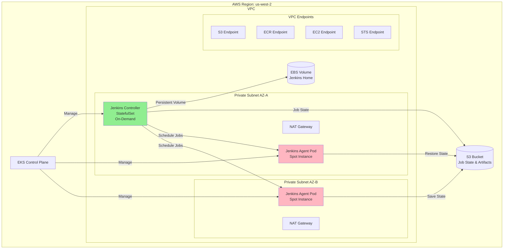
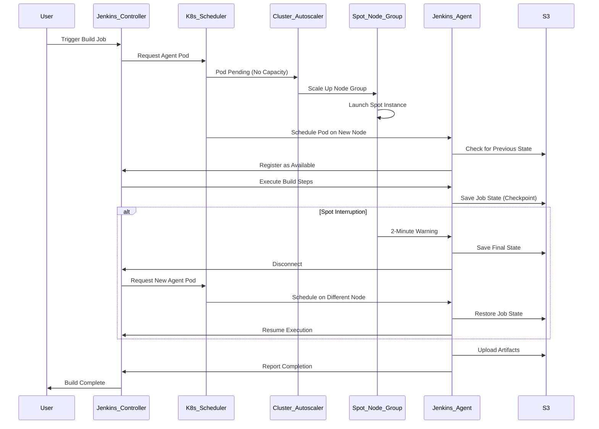

# Design Document: Jenkins EKS Cluster

## Overview

This design document describes the architecture and implementation approach for deploying Jenkins on Amazon EKS with cost-optimized spot instances for CI/CD workloads. The solution leverages EKS managed node groups, Kubernetes StatefulSets for the Jenkins controller, and dynamic pod-based agents running on spot instances. The architecture ensures high availability for the controller while optimizing costs through spot instances for ephemeral build agents.

Key design principles:
- **Separation of concerns**: Controller runs on reliable on-demand instances; agents run on cost-optimized spot instances
- **State preservation**: Jenkins configuration persists on EBS; job state and artifacts stored in S3
- **Automatic scaling**: Cluster Autoscaler dynamically provisions spot instances based on build queue depth
- **Security**: IRSA (IAM Roles for Service Accounts) provides fine-grained AWS permissions without credential management

## Architecture

### High-Level Architecture



### Component Interaction Flow



## Components and Interfaces

### 1. EKS Cluster

**Purpose**: Managed Kubernetes control plane and worker nodes

**Configuration**:
- **Region**: us-west-2
- **Kubernetes Version**: 1.28 or later
- **Availability Zones**: us-west-2a, us-west-2b (minimum)
- **Endpoint Access**: Private only (no public endpoint)
- **Logging**: Enable all log types (api, audit, authenticator, controllerManager, scheduler)

**Node Groups**:

1. **Controller Node Group** (On-Demand)
   - Instance Types: t3.large or t3.xlarge
   - Capacity Type: ON_DEMAND
   - Min/Max/Desired: 1/2/1
   - Labels: `workload-type=jenkins-controller`
   - Taints: `workload-type=jenkins-controller:NoSchedule`

2. **Agent Node Group** (Spot)
   - Instance Types: m5.large, m5.xlarge, m5a.large, m5a.xlarge, m6i.large, m6i.xlarge
   - Capacity Type: SPOT
   - Capacity Rebalancing: Enabled
   - Min/Max/Desired: 2/10/2
   - Labels: `workload-type=jenkins-agent`, `node-lifecycle=spot`
   - Allocation Strategy: price-capacity-optimized

**Interface**: AWS EKS API, kubectl, eksctl

### 2. VPC and Networking

**Purpose**: Network isolation and connectivity for EKS cluster

**VPC Configuration**:
- **CIDR Block**: 10.0.0.0/16 (65,536 IPs)
- **DNS Hostnames**: Enabled
- **DNS Resolution**: Enabled

**Subnets**:
- **Private Subnet AZ-A**: 10.0.1.0/24 (us-west-2a)
- **Private Subnet AZ-B**: 10.0.2.0/24 (us-west-2b)

**NAT Gateways**:
- One NAT Gateway per AZ for high availability
- Elastic IPs allocated for each NAT Gateway

**VPC Endpoints** (Interface endpoints for private connectivity):
- **S3**: Gateway endpoint (no cost)
- **ECR API**: Interface endpoint
- **ECR Docker**: Interface endpoint
- **EC2**: Interface endpoint
- **STS**: Interface endpoint
- **CloudWatch Logs**: Interface endpoint

**Security Groups**:

1. **Jenkins Controller Security Group**
   - Inbound: Port 8080 (HTTP) from VPC CIDR
   - Inbound: Port 50000 (JNLP) from Agent Security Group
   - Outbound: All traffic

2. **Jenkins Agent Security Group**
   - Inbound: Ephemeral ports from Controller Security Group
   - Outbound: All traffic

3. **EKS Cluster Security Group**
   - Managed by EKS (default rules)

**Interface**: AWS VPC API, Terraform/CloudFormation

### 3. Jenkins Controller

**Purpose**: Central Jenkins server for job orchestration and configuration management

**Deployment Type**: Kubernetes StatefulSet

**Container Image**: jenkins/jenkins:lts

**Resource Allocation**:
- CPU Request: 2 cores
- CPU Limit: 4 cores
- Memory Request: 4Gi
- Memory Limit: 8Gi

**Persistent Storage**:
- **Volume Type**: EFS (Elastic File System)
- **Size**: Elastic (grows automatically)
- **Mount Path**: /var/jenkins_home
- **Storage Class**: efs-sc
- **Access Mode**: ReadWriteMany
- **Backup**: AWS Backup for EFS with 30-day retention

**Service Configuration**:
- **Service Type**: ClusterIP
- **HTTP Port**: 8080
- **JNLP Port**: 50000

**Node Placement**:
- **Node Selector**: `workload-type=jenkins-controller`
- **Tolerations**: `workload-type=jenkins-controller:NoSchedule`

**Environment Variables**:
- `JAVA_OPTS`: `-Xmx4g -Xms2g`
- `JENKINS_OPTS`: `--sessionTimeout=1440`

**Plugins** (to be installed):
- Kubernetes Plugin (for dynamic agent provisioning)
- AWS Steps Plugin (for AWS API interactions)
- Pipeline Plugin (for Jenkinsfile support)
- S3 Plugin (for artifact storage)
- Spot Instance Plugin (for spot interruption handling)

**Interface**: Kubernetes API, Jenkins REST API, Jenkins CLI

### 4. Jenkins Agents

**Purpose**: Ephemeral workers that execute build jobs

**Deployment Type**: Kubernetes Pods (dynamically created by Jenkins Kubernetes Plugin)

**Container Image**: jenkins/inbound-agent:latest (or custom images with build tools)

**Resource Allocation** (per agent):
- CPU Request: 1 core
- CPU Limit: 2 cores
- Memory Request: 2Gi
- Memory Limit: 4Gi

**Node Placement**:
- **Node Affinity**: Prefer nodes with label `node-lifecycle=spot`
- **Anti-Affinity**: Avoid scheduling on controller nodes

**Lifecycle**:
1. Jenkins Controller requests agent pod via Kubernetes Plugin
2. Kubernetes schedules pod on available spot instance node
3. Agent connects to controller via JNLP on port 50000
4. Agent executes job steps
5. Agent saves state to S3 at regular intervals
6. On completion or interruption, agent terminates

**Spot Interruption Handling**:
- AWS Node Termination Handler DaemonSet monitors EC2 metadata
- On 2-minute warning, handler cordons node and drains pods gracefully
- Agent saves final state to S3 before termination
- Jenkins reschedules job on new agent pod
- New agent restores state from S3 and resumes execution

**Interface**: Jenkins Remoting Protocol, Kubernetes API

### 5. Storage Layer

**EFS File System** (Jenkins Controller):
- **Purpose**: Store Jenkins home directory (configs, jobs, plugins, build history)
- **Performance Mode**: General Purpose
- **Throughput Mode**: Bursting (scales automatically with file system size)
- **Encryption**: Enabled (AWS managed key or customer managed KMS key)
- **Lifecycle Management**: Transition to Infrequent Access (IA) after 30 days
- **Backup**: AWS Backup with daily backups and 30-day retention
- **Mount Targets**: One mount target per availability zone in private subnets
- **Security Group**: Allow NFS traffic (port 2049) from EKS worker nodes

**EFS CSI Driver**:
- **Purpose**: Enable Kubernetes to provision and mount EFS volumes
- **Deployment**: DaemonSet on all worker nodes
- **Storage Class**: efs-sc (dynamic provisioning)
- **Access Points**: Optional, for isolating Jenkins data within EFS

**S3 Bucket** (Job State and Artifacts):
- **Purpose**: Store job execution state, workspace snapshots, and build artifacts
- **Bucket Name**: `jenkins-{account-id}-{region}-artifacts`
- **Versioning**: Enabled
- **Encryption**: SSE-S3 (server-side encryption)
- **Lifecycle Policy**:
  - Transition to Intelligent-Tiering after 30 days
  - Delete after 90 days (configurable)
- **Object Structure**:
  ```
  /job-state/{job-name}/{build-number}/state.json
  /job-state/{job-name}/{build-number}/workspace.tar.gz
  /artifacts/{job-name}/{build-number}/*
  ```

**Interface**: EFS CSI Driver, AWS EFS API, AWS S3 API

### 6. IAM Roles and Permissions

**EKS Cluster Role**:
- **Purpose**: Allow EKS service to manage cluster resources
- **Managed Policies**: AmazonEKSClusterPolicy

**EKS Node Role** (for both node groups):
- **Purpose**: Allow worker nodes to join cluster and pull images
- **Managed Policies**:
  - AmazonEKSWorkerNodePolicy
  - AmazonEC2ContainerRegistryReadOnly
  - AmazonEKS_CNI_Policy
  - AmazonSSMManagedInstanceCore (for Systems Manager access)

**Jenkins Controller IAM Role** (via IRSA):
- **Purpose**: Allow Jenkins to deploy AWS infrastructure
- **Service Account**: jenkins-controller (in jenkins namespace)
- **Trust Policy**: Allow EKS OIDC provider to assume role
- **Permissions**:
  ```json
  {
    "Version": "2012-10-17",
    "Statement": [
      {
        "Effect": "Allow",
        "Action": [
          "cloudformation:*",
          "s3:*",
          "dynamodb:*",
          "ec2:Describe*",
          "ec2:CreateTags",
          "ec2:DeleteTags",
          "vpc:*",
          "iam:GetRole",
          "iam:PassRole",
          "iam:CreateRole",
          "iam:DeleteRole",
          "iam:AttachRolePolicy",
          "iam:DetachRolePolicy",
          "eks:Describe*",
          "eks:List*",
          "sts:AssumeRole"
        ],
        "Resource": "*"
      },
      {
        "Effect": "Allow",
        "Action": [
          "s3:GetObject",
          "s3:PutObject",
          "s3:DeleteObject"
        ],
        "Resource": "arn:aws:s3:::jenkins-*-artifacts/*"
      }
    ]
  }
  ```

**Cluster Autoscaler IAM Role** (via IRSA):
- **Purpose**: Allow Cluster Autoscaler to scale node groups
- **Service Account**: cluster-autoscaler (in kube-system namespace)
- **Permissions**:
  ```json
  {
    "Version": "2012-10-17",
    "Statement": [
      {
        "Effect": "Allow",
        "Action": [
          "autoscaling:DescribeAutoScalingGroups",
          "autoscaling:DescribeAutoScalingInstances",
          "autoscaling:DescribeLaunchConfigurations",
          "autoscaling:DescribeScalingActivities",
          "autoscaling:DescribeTags",
          "ec2:DescribeImages",
          "ec2:DescribeInstanceTypes",
          "ec2:DescribeLaunchTemplateVersions",
          "ec2:GetInstanceTypesFromInstanceRequirements",
          "eks:DescribeNodegroup"
        ],
        "Resource": "*"
      },
      {
        "Effect": "Allow",
        "Action": [
          "autoscaling:SetDesiredCapacity",
          "autoscaling:TerminateInstanceInAutoScalingGroup"
        ],
        "Resource": "*",
        "Condition": {
          "StringEquals": {
            "autoscaling:ResourceTag/k8s.io/cluster-autoscaler/enabled": "true"
          }
        }
      }
    ]
  }
  ```

**EFS CSI Driver IAM Role** (via IRSA):
- **Purpose**: Allow EFS CSI Driver to manage EFS access points and mount targets
- **Service Account**: efs-csi-controller-sa (in kube-system namespace)
- **Permissions**:
  ```json
  {
    "Version": "2012-10-17",
    "Statement": [
      {
        "Effect": "Allow",
        "Action": [
          "elasticfilesystem:DescribeAccessPoints",
          "elasticfilesystem:DescribeFileSystems",
          "elasticfilesystem:DescribeMountTargets",
          "elasticfilesystem:CreateAccessPoint",
          "elasticfilesystem:DeleteAccessPoint",
          "elasticfilesystem:TagResource"
        ],
        "Resource": "*"
      }
    ]
  }
  ```

**Interface**: AWS IAM API, EKS OIDC Provider

### 7. Cluster Autoscaler

**Purpose**: Automatically scale spot instance node group based on pending pods

**Deployment Type**: Kubernetes Deployment

**Container Image**: registry.k8s.io/autoscaling/cluster-autoscaler:v1.28.0

**Configuration**:
- **Auto-Discovery**: Enabled (discovers node groups with specific tags)
- **Scale Down Delay**: 10 minutes after node becomes unneeded
- **Scale Down Utilization Threshold**: 0.5 (50%)
- **Max Node Provision Time**: 15 minutes
- **Skip Nodes with System Pods**: false
- **Balance Similar Node Groups**: true
- **Expander**: priority (prioritize spot over on-demand)

**Command Line Flags**:
```bash
--cloud-provider=aws
--aws-use-static-instance-list=false
--balance-similar-node-groups
--skip-nodes-with-system-pods=false
--scale-down-delay-after-add=10m
--scale-down-unneeded-time=10m
--node-group-auto-discovery=asg:tag=k8s.io/cluster-autoscaler/enabled,k8s.io/cluster-autoscaler/jenkins-eks-cluster
```

**Node Group Tags** (for auto-discovery):
- `k8s.io/cluster-autoscaler/enabled`: true
- `k8s.io/cluster-autoscaler/jenkins-eks-cluster`: owned

**Interface**: Kubernetes API, AWS Auto Scaling API

### 8. AWS Node Termination Handler

**Purpose**: Gracefully handle spot instance interruptions

**Deployment Type**: Kubernetes DaemonSet (runs on all spot nodes)

**Container Image**: public.ecr.aws/aws-ec2/aws-node-termination-handler:latest

**Configuration**:
- **Enable Spot Interruption Draining**: true
- **Enable Scheduled Event Draining**: true
- **Pod Termination Grace Period**: 120 seconds
- **Node Termination Grace Period**: 120 seconds
- **Webhook URL**: (optional, for notifications)

**Behavior**:
1. Monitors EC2 instance metadata for spot interruption notices
2. On 2-minute warning, cordons the node (prevents new pods)
3. Drains existing pods gracefully (respects termination grace period)
4. Pods save state to S3 before termination
5. Kubernetes reschedules pods on other nodes

**Interface**: EC2 Instance Metadata Service, Kubernetes API

### 9. EFS CSI Driver

**Purpose**: Enable Kubernetes to dynamically provision and mount EFS volumes

**Deployment Type**: Kubernetes DaemonSet (node plugin) + Deployment (controller)

**Container Images**:
- Controller: amazon/aws-efs-csi-driver:latest
- Node: amazon/aws-efs-csi-driver:latest

**Components**:

1. **CSI Controller** (Deployment):
   - Manages EFS access point creation/deletion
   - Handles volume provisioning requests
   - Runs on control plane or dedicated nodes

2. **CSI Node Plugin** (DaemonSet):
   - Runs on all worker nodes
   - Mounts EFS file systems to pods
   - Handles volume mount/unmount operations

**Storage Class Configuration**:
```yaml
apiVersion: storage.k8s.io/v1
kind: StorageClass
metadata:
  name: efs-sc
provisioner: efs.csi.aws.com
parameters:
  provisioningMode: efs-ap  # Use EFS Access Points
  fileSystemId: fs-xxxxx    # EFS File System ID
  directoryPerms: "700"     # Directory permissions
  gidRangeStart: "1000"     # GID range for access points
  gidRangeEnd: "2000"
  basePath: "/jenkins"      # Base path for access points
```

**IAM Role** (via IRSA):
- Service Account: efs-csi-controller-sa
- Permissions: Create/delete EFS access points, describe file systems

**Interface**: Kubernetes CSI API, AWS EFS API

## Data Models

### Jenkins Job State (S3)

**Purpose**: Preserve job execution state for resumption after spot interruption

**Schema** (state.json):
```json
{
  "jobName": "string",
  "buildNumber": "integer",
  "timestamp": "ISO8601 datetime",
  "status": "enum[running, interrupted, completed]",
  "currentStage": "string",
  "completedStages": ["string"],
  "environmentVariables": {
    "key": "value"
  },
  "workspaceChecksum": "string (SHA256)",
  "artifacts": ["string (S3 keys)"]
}
```

**Workspace Snapshot** (workspace.tar.gz):
- Compressed archive of job workspace directory
- Uploaded to S3 at regular intervals (every 5 minutes)
- Restored when job resumes on new agent

### Kubernetes Resources

**StatefulSet** (Jenkins Controller):
```yaml
apiVersion: apps/v1
kind: StatefulSet
metadata:
  name: jenkins-controller
  namespace: jenkins
spec:
  serviceName: jenkins
  replicas: 1
  selector:
    matchLabels:
      app: jenkins-controller
  template:
    metadata:
      labels:
        app: jenkins-controller
    spec:
      serviceAccountName: jenkins-controller
      nodeSelector:
        workload-type: jenkins-controller
      tolerations:
      - key: workload-type
        operator: Equal
        value: jenkins-controller
        effect: NoSchedule
      containers:
      - name: jenkins
        image: jenkins/jenkins:lts
        ports:
        - containerPort: 8080
          name: http
        - containerPort: 50000
          name: jnlp
        resources:
          requests:
            cpu: "2"
            memory: "4Gi"
          limits:
            cpu: "4"
            memory: "8Gi"
        volumeMounts:
        - name: jenkins-home
          mountPath: /var/jenkins_home
  volumeClaimTemplates:
  - metadata:
      name: jenkins-home
    spec:
      accessModes: ["ReadWriteMany"]
      storageClassName: efs-sc
      resources:
        requests:
          storage: 100Gi  # Symbolic size, EFS grows automatically
```

**PodTemplate** (Jenkins Agent - configured in Jenkins):
```yaml
apiVersion: v1
kind: Pod
metadata:
  labels:
    jenkins: agent
spec:
  affinity:
    nodeAffinity:
      preferredDuringSchedulingIgnoredDuringExecution:
      - weight: 100
        preference:
          matchExpressions:
          - key: node-lifecycle
            operator: In
            values:
            - spot
    podAntiAffinity:
      requiredDuringSchedulingIgnoredDuringExecution:
      - labelSelector:
          matchExpressions:
          - key: app
            operator: In
            values:
            - jenkins-controller
        topologyKey: kubernetes.io/hostname
  containers:
  - name: jnlp
    image: jenkins/inbound-agent:latest
    resources:
      requests:
        cpu: "1"
        memory: "2Gi"
      limits:
        cpu: "2"
        memory: "4Gi"
    env:
    - name: JENKINS_URL
      value: "http://jenkins:8080"
```

## Correctness Properties

*A property is a characteristic or behavior that should hold true across all valid executions of a system—essentially, a formal statement about what the system should do. Properties serve as the bridge between human-readable specifications and machine-verifiable correctness guarantees.*

For infrastructure-as-code, most correctness validation involves verifying that resources are configured according to specifications. The following properties capture the key behavioral guarantees of the system:

**Property 1: Data Persistence Across Pod Restarts**

*For any* Jenkins controller pod restart (whether due to failure, update, or rescheduling), all Jenkins configuration data, job definitions, plugin data, and build history stored in the persistent volume SHALL remain intact and accessible after the pod restarts.

**Validates: Requirements 3.7**

**Property 2: Persistent Volume Remounting**

*For any* Jenkins controller pod rescheduling event, the EFS file system SHALL be automatically remounted to the new pod instance, ensuring continuity of data access without data loss.

**Validates: Requirements 6.10**

### Configuration Validation Examples

The following are specific configuration checks that validate infrastructure is deployed correctly. These are tested as examples rather than universal properties:

**Infrastructure Configuration Checks:**
- EKS cluster deployed in us-west-2 region (Requirement 1.1)
- Kubernetes version 1.28 or later (Requirement 1.2)
- Cluster spans at least 2 availability zones (Requirement 1.3)
- Cluster logging enabled for all log types (Requirement 1.4)
- Private endpoint access configured (Requirement 1.5)

**Network Configuration Checks:**
- VPC CIDR supports at least 1000 IPs (Requirement 2.1)
- At least 2 private subnets in different AZs (Requirement 2.2)
- NAT Gateway in each AZ (Requirement 2.3)
- Security groups properly configured (Requirements 2.4, 2.5)
- VPC endpoints for S3, ECR, EC2, STS (Requirement 2.6)

**Jenkins Controller Configuration Checks:**
- Deployed as StatefulSet with 1 replica (Requirement 3.1)
- PVC with ReadWriteOnce access mode (Requirement 3.2)
- Resource requests: 4GB memory, 2 CPU cores (Requirement 3.3)
- Kubernetes Service exists (Requirement 3.4)
- Restart policy configured (Requirement 3.6)
- Node selector for on-demand instances (Requirement 3.9)

**Spot Instance Configuration Checks:**
- Node group capacity type is SPOT (Requirement 4.1)
- Correct instance types configured (Requirement 4.2, 4.7)
- Scaling limits: min 2, max 10 (Requirement 4.5)
- Agent pods have spot node affinity (Requirement 4.6)
- Controller has anti-affinity for spot nodes (Requirement 4.8)

**IAM Configuration Checks:**
- IAM role with required permissions (Requirements 5.1, 5.5)
- Service account with IRSA annotations (Requirement 5.3)
- Pod uses correct service account (Requirement 5.4)
- Session duration at least 3600 seconds (Requirement 5.7)

**Storage Configuration Checks:**
- PV uses EFS backend (Requirement 6.1)
- EFS deployed across multiple AZs (Requirement 6.2)
- EFS performance mode is General Purpose (Requirement 6.3)
- EFS encryption enabled (Requirement 6.4)
- AWS Backup configured for EFS (Requirement 6.5)
- EFS mount targets in each AZ (Requirement 6.6)
- Security group allows NFS traffic (Requirement 6.7)
- EFS CSI Driver installed (Requirement 6.8)
- PVC access mode is ReadWriteMany (Requirement 6.9)
- S3 bucket for artifacts exists (Requirement 6.12)
- EFS lifecycle policy configured (Requirement 6.13)

**Autoscaling Configuration Checks:**
- Cluster Autoscaler deployed (Requirement 8.1)
- Node group min/max constraints (Requirement 8.5)
- Autoscaler expander prioritizes spot (Requirement 8.6)

**Security Configuration Checks:**
- Kubernetes RBAC resources exist (Requirement 9.4)
- Encryption at rest enabled (Requirement 9.6)

**Monitoring Configuration Checks:**
- Container Insights enabled (Requirement 10.1)
- Logging infrastructure configured (Requirement 10.3)
- CloudWatch alarms configured (Requirement 10.4)
- Monitoring dashboards exist (Requirement 10.6)

**Backup Configuration Checks:**
- Automated backup schedule configured (Requirement 11.1)
- Backup retention at least 30 days (Requirement 11.4)

## Error Handling

### Spot Instance Interruptions

**Scenario**: AWS sends 2-minute warning before terminating spot instance

**Handling**:
1. AWS Node Termination Handler detects interruption notice via EC2 metadata
2. Handler cordons the node (prevents new pod scheduling)
3. Handler drains pods gracefully with 120-second grace period
4. Jenkins agents save current job state to S3
5. Kubernetes reschedules agent pods on available nodes
6. New agents restore job state from S3 and resume execution

**Fallback**: If state cannot be saved, job is marked as failed with interruption reason

### Persistent Volume Mount Failures

**Scenario**: EFS file system fails to mount to Jenkins controller pod

**Handling**:
1. Kubernetes retries volume mount with exponential backoff
2. If mount fails after 10 minutes, pod remains in ContainerCreating state
3. CloudWatch alarm triggers for pod not ready
4. Check EFS mount target status and security group rules
5. Verify NFS traffic (port 2049) is allowed from worker nodes
6. Check EFS file system is available and not deleted

**Prevention**: Ensure EFS mount targets exist in all AZs, security groups allow NFS traffic

### EFS Performance Issues

**Scenario**: Jenkins experiences slow I/O due to EFS throughput limits

**Handling**:
1. Monitor EFS CloudWatch metrics (BurstCreditBalance, PermittedThroughput)
2. If burst credits depleted, consider switching to Provisioned Throughput mode
3. Alternatively, implement EFS lifecycle management to move old data to IA storage class
4. Use S3 for large artifacts instead of storing on EFS

**Prevention**: Right-size EFS throughput mode based on workload, use S3 for artifacts

### Node Group Scaling Failures

**Scenario**: Cluster Autoscaler cannot provision new spot instances

**Handling**:
1. Autoscaler attempts to launch instances from configured instance type list
2. If all spot instance types unavailable, falls back to on-demand instances (if configured)
3. If scaling fails completely, pods remain in Pending state
4. CloudWatch alarm triggers for pending pods exceeding threshold
5. Jenkins jobs queue until capacity becomes available

**Mitigation**: Configure diverse instance type list to increase spot availability

### IAM Permission Errors

**Scenario**: Jenkins pipeline fails due to insufficient IAM permissions

**Handling**:
1. AWS API returns AccessDenied error
2. Jenkins job fails with error message indicating missing permission
3. CloudWatch Logs capture the specific API call and required permission
4. Administrator updates IAM role policy with required permission
5. Job can be retried without code changes

**Prevention**: Use IAM policy simulator to test permissions before deployment

### EFS Storage Full

**Scenario**: EFS file system grows too large and incurs high costs

**Handling**:
1. Monitor EFS CloudWatch metrics for file system size
2. Configure Jenkins to limit build history retention
3. Enable EFS lifecycle management to transition old files to IA storage class
4. Archive old builds to S3 and delete from EFS
5. Set up CloudWatch alarm for EFS size exceeding threshold

**Prevention**: Configure Jenkins build retention policies, use S3 for long-term artifact storage

### Network Connectivity Issues

**Scenario**: Jenkins agents cannot connect to controller

**Handling**:
1. Agent pod fails to establish JNLP connection on port 50000
2. Pod enters CrashLoopBackOff state after multiple connection failures
3. Check security group rules allow traffic between agent and controller
4. Check DNS resolution for jenkins service
5. Verify controller pod is running and listening on port 50000

**Diagnostics**: Use kubectl exec to test connectivity from agent pod to controller service

## Testing Strategy

### Dual Testing Approach

This infrastructure project requires both **unit tests** (specific configuration validation) and **property-based tests** (behavioral guarantees). Together, they provide comprehensive coverage:

- **Unit tests**: Validate specific infrastructure configurations match requirements
- **Property tests**: Verify behavioral guarantees hold across different scenarios

### Infrastructure Testing with Terraform/Terratest

**Unit Tests** (using Terratest or similar):
- Validate Terraform plan output matches expected resource configurations
- Check resource attributes (instance types, CIDR blocks, storage sizes)
- Verify resource relationships (security group rules, IAM role attachments)
- Test each configuration check listed in the Correctness Properties section

**Property-Based Tests**:
- Test data persistence across pod restarts (Property 1)
- Test persistent volume reattachment after rescheduling (Property 2)
- Each property test should run minimum 100 iterations
- Tag format: **Feature: jenkins-eks-cluster, Property {number}: {property_text}**

**Integration Tests**:
- Deploy complete infrastructure to test environment
- Verify Jenkins controller starts successfully
- Verify agent pods can connect to controller
- Verify spot instance interruption handling
- Verify autoscaling behavior
- Verify IAM permissions work for sample deployment

**Test Environment**:
- Use separate AWS account or isolated VPC for testing
- Use smaller instance types and node counts to reduce costs
- Clean up resources after test completion

### Testing Tools

**Recommended Tools**:
- **Terratest** (Go): Infrastructure testing framework for Terraform
- **pytest** (Python): For testing Kubernetes manifests and AWS resources
- **kubectl**: For Kubernetes resource validation
- **aws-cli**: For AWS resource validation
- **Hypothesis** (Python): Property-based testing library

**Example Test Structure**:
```
tests/
├── unit/
│   ├── test_eks_cluster.py          # EKS cluster configuration tests
│   ├── test_vpc_networking.py       # VPC and networking tests
│   ├── test_iam_roles.py            # IAM role and policy tests
│   ├── test_jenkins_controller.py   # Jenkins controller deployment tests
│   └── test_node_groups.py          # Node group configuration tests
├── property/
│   ├── test_data_persistence.py     # Property 1: Data persistence
│   └── test_volume_reattachment.py  # Property 2: Volume reattachment
└── integration/
    ├── test_end_to_end.py           # Full deployment test
    └── test_spot_interruption.py    # Spot interruption handling test
```

### Property Test Configuration

Each property-based test must:
1. Run minimum 100 iterations (due to randomization)
2. Reference its design document property in a comment
3. Use tag format: **Feature: jenkins-eks-cluster, Property {number}: {property_text}**

**Example Property Test** (pseudocode):
```python
# Feature: jenkins-eks-cluster, Property 1: Data Persistence Across Pod Restarts
@given(jenkins_data=jenkins_configuration_generator())
def test_data_persistence_across_restarts(jenkins_data):
    # Write data to Jenkins home directory on EFS
    write_jenkins_data_to_efs(jenkins_data)
    
    # Restart Jenkins controller pod
    restart_jenkins_pod()
    
    # Verify data is still present on EFS
    assert read_jenkins_data_from_efs() == jenkins_data

# Feature: jenkins-eks-cluster, Property 2: Persistent Volume Remounting
@given(pod_name=pod_name_generator())
def test_efs_remount_after_rescheduling(pod_name):
    # Get current EFS mount point
    original_mount = get_efs_mount_info(pod_name)
    
    # Delete and reschedule pod
    delete_pod(pod_name)
    wait_for_pod_ready(pod_name)
    
    # Verify EFS is remounted
    new_mount = get_efs_mount_info(pod_name)
    assert new_mount.filesystem_id == original_mount.filesystem_id
    assert new_mount.is_mounted == True
```

### Test Execution Strategy

**Pre-deployment**:
1. Run unit tests on Terraform plan
2. Validate all configuration checks pass
3. Run static analysis on Kubernetes manifests

**Post-deployment**:
1. Run property-based tests against deployed infrastructure
2. Run integration tests to verify end-to-end functionality
3. Run spot interruption simulation tests

**Continuous Testing**:
1. Run unit tests on every infrastructure code change
2. Run integration tests nightly against test environment
3. Run property tests weekly to verify behavioral guarantees

### Success Criteria

All tests must pass before infrastructure is considered production-ready:
- 100% of unit tests pass (all configuration checks)
- 100% of property tests pass (all behavioral guarantees)
- Integration tests demonstrate successful Jenkins job execution
- Spot interruption tests show graceful handling and job resumption

