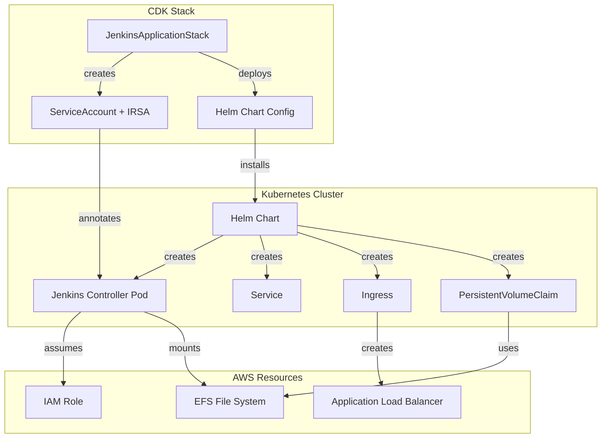
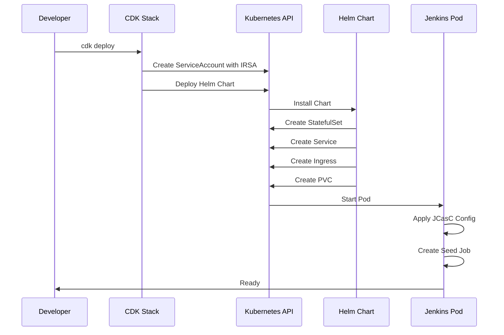

# Design Document: Jenkins Helm Migration

## Overview

This design describes the migration from individual CDK manifests to the official Jenkins Helm chart for deploying Jenkins on EKS. The migration maintains the core deployment philosophy: everything is managed through CDK code with no manual kubectl or helm commands required.

### Current Architecture

The current deployment uses approximately 10 individual Kubernetes manifests managed by CDK:
- Namespace
- ServiceAccount (created via CDK addServiceAccount)
- RBAC (Role, RoleBinding)
- ConfigMaps (plugins, JCasC, agent templates)
- StatefulSet
- Service
- Ingress
- PersistentVolume (static, using NFS)
- PersistentVolumeClaim
- StorageClass

### Target Architecture

The target deployment uses the official Jenkins Helm chart (https://charts.jenkins.io) deployed via CDK's `cluster.addHelmChart()` method:
- ServiceAccount still created via CDK (for IRSA)
- Helm chart references existing ServiceAccount
- All configuration via Helm values in TypeScript
- Seed job creation automated via JCasC
- Same EFS storage, same IRSA permissions, same ALB ingress

### Key Benefits

1. **Simplified Maintenance**: Leverage community-maintained Helm chart instead of custom manifests
2. **Reduced Code**: Replace ~10 manifest files with single Helm chart configuration
3. **Better Defaults**: Helm chart includes production-ready defaults and best practices
4. **Easier Upgrades**: Jenkins version upgrades via Helm chart version bumps
5. **Automated Seed Jobs**: No more manual kubectl apply for seed job creation

## Architecture

### Component Diagram



### Deployment Flow



## Components and Interfaces

### 1. CDK Stack Component

**File**: `lib/jenkins/jenkins-application-stack.ts`

**Responsibilities**:
- Create ServiceAccount with IRSA
- Deploy Helm chart with configuration
- Manage dependencies between resources
- Export CloudFormation outputs

**Key Methods**:

```typescript
class JenkinsApplicationStack extends cdk.Stack {
  constructor(scope: Construct, id: string, props: JenkinsApplicationStackProps) {
    // Create ServiceAccount with IRSA (existing pattern)
    const jenkinsServiceAccount = props.cluster.addServiceAccount('JenkinsControllerServiceAccount', {
      name: 'jenkins-controller',
      namespace: 'jenkins',
    });
    
    // Attach IAM policy
    jenkinsServiceAccount.role.attachInlinePolicy(/* ... */);
    
    // Deploy Helm chart
    const jenkinsHelmChart = props.cluster.addHelmChart('JenkinsHelmChart', {
      chart: 'jenkins',
      repository: 'https://charts.jenkins.io',
      namespace: 'jenkins',
      createNamespace: true,
      version: '5.7.0', // Pin to specific version
      values: {
        // Helm values configuration
      },
    });
    
    // Set dependencies
    jenkinsHelmChart.node.addDependency(jenkinsServiceAccount);
  }
}
```

### 2. Helm Values Configuration

**Structure**: TypeScript object passed to `cluster.addHelmChart()`

**Key Sections**:

```typescript
const helmValues = {
  controller: {
    // Service Account
    serviceAccount: {
      create: false,  // Use CDK-created SA
      name: 'jenkins-controller',
    },
    
    // Resources
    resources: {
      requests: { cpu: '2000m', memory: '8Gi' },
      limits: { cpu: '4', memory: '12Gi' },
    },
    
    // Java Options
    javaOpts: '-Xmx8g -Xms4g',
    jenkinsOpts: '--sessionTimeout=1440',
    numExecutors: 0,
    
    // Node Placement
    nodeSelector: {
      'workload-type': 'jenkins-controller',
    },
    tolerations: [{
      key: 'workload-type',
      operator: 'Equal',
      value: 'jenkins-controller',
      effect: 'NoSchedule',
    }],
    
    // Service
    serviceType: 'ClusterIP',
    servicePort: 8080,
    
    // Ingress
    ingress: {
      enabled: true,
      ingressClassName: 'alb',
      annotations: {
        'alb.ingress.kubernetes.io/scheme': 'internet-facing',
        'alb.ingress.kubernetes.io/target-type': 'ip',
        'alb.ingress.kubernetes.io/healthcheck-path': '/login',
        'alb.ingress.kubernetes.io/listen-ports': '[{"HTTP": 80}]',
        'alb.ingress.kubernetes.io/security-groups': props.albSecurityGroup.securityGroupId,
        'alb.ingress.kubernetes.io/load-balancer-name': 'jenkins-alb',
      },
    },
    
    // Plugins
    installPlugins: [
      'kubernetes:4360.v0e4b_1c40e9e5',
      'workflow-aggregator:600.vb_57cdd26fdd7',
      'git:5.7.0',
      'configuration-as-code:1909.vb_b_f59a_b_b_5d61',
      'job-dsl:1.92',
      'docker-workflow:580.vc0c340686b_54',
    ],
    
    // JCasC
    JCasC: {
      defaultConfig: true,
      configScripts: {
        'welcome-message': `
          jenkins:
            systemMessage: "Jenkins on EKS - Configured via Helm + JCasC"
        `,
        'kubernetes-cloud': `
          jenkins:
            clouds:
            - kubernetes:
                name: "kubernetes"
                serverUrl: "https://kubernetes.default"
                namespace: "jenkins"
                jenkinsUrl: "http://jenkins:8080"
                jenkinsTunnel: "jenkins:50000"
                templates:
                - name: "jenkins-agent-dind"
                  namespace: "jenkins"
                  label: "jenkins-agent"
                  serviceAccount: "jenkins-controller"
                  yaml: |
                    # Pod template YAML
        `,
        'jobs': `
          jobs:
            - script: >
                pipelineJob('seed-job') {
                  description('Seed job for Job DSL')
                  definition {
                    cps {
                      script('''
                        // Job DSL script
                      ''')
                      sandbox(false)
                    }
                  }
                }
        `,
      },
    },
  },
  
  // Disable agent
  agent: {
    enabled: false,
  },
  
  // Persistence
  persistence: {
    enabled: true,
    storageClass: 'jenkins-efs',
    size: '100Gi',
    accessMode: 'ReadWriteMany',
  },
  
  // RBAC
  rbac: {
    create: true,
    readSecrets: true,
  },
};
```

### 3. Storage Component

**Existing Component**: `JenkinsStorageStack` (no changes required)

**Interface**:
- Exports EFS file system
- Provides file system ID
- Configures NFS mount targets

**Integration**:
- Helm chart references existing StorageClass `jenkins-efs`
- PVC created by Helm chart uses existing PV
- No changes to EFS configuration

### 4. ServiceAccount and IRSA Component

**Pattern**: CDK `addServiceAccount()` method

**Flow**:
1. CDK creates ServiceAccount in Kubernetes
2. CDK creates IAM role with IRSA trust policy
3. CDK adds annotation to ServiceAccount with role ARN
4. Helm chart references existing ServiceAccount (create: false)
5. Jenkins pods assume IAM role via IRSA

**IAM Policy**: Same as current deployment (CloudFormation, S3, DynamoDB, EC2, VPC, IAM, EKS, STS, ECR, Secrets Manager, KMS)

### 5. Seed Job Component

**Current State**: Manual kubectl apply of Job resource

**New State**: Automated via JCasC

**Implementation**:

```yaml
# In JCasC configScripts.jobs
jobs:
  - script: >
      pipelineJob('seed-job') {
        description('Seed job for Job DSL')
        definition {
          cps {
            script('''
              // Clone repo and execute Job DSL
              node {
                git url: 'https://github.com/peterboddev/eks_jenkins_central_api_gw_app_ekses.git',
                    branch: 'main'
                jobDsl targets: 'jenkins-jobs/seed-job.groovy',
                       sandbox: false
              }
            ''')
            sandbox(false)
          }
        }
      }
```

**Benefits**:
- No manual kubectl apply required
- Seed job created on Jenkins startup
- Configuration version-controlled in CDK

## Data Models

### Helm Chart Values Schema

```typescript
interface JenkinsHelmValues {
  controller: {
    serviceAccount: {
      create: boolean;
      name: string;
    };
    resources: {
      requests: { cpu: string; memory: string };
      limits: { cpu: string; memory: string };
    };
    javaOpts: string;
    jenkinsOpts: string;
    numExecutors: number;
    nodeSelector: Record<string, string>;
    tolerations: Array<{
      key: string;
      operator: string;
      value: string;
      effect: string;
    }>;
    serviceType: string;
    servicePort: number;
    ingress: {
      enabled: boolean;
      ingressClassName: string;
      annotations: Record<string, string>;
    };
    installPlugins: string[];
    JCasC: {
      defaultConfig: boolean;
      configScripts: Record<string, string>;
    };
  };
  agent: {
    enabled: boolean;
  };
  persistence: {
    enabled: boolean;
    storageClass: string;
    size: string;
    accessMode: string;
  };
  rbac: {
    create: boolean;
    readSecrets: boolean;
  };
}
```

### Migration State Model

```typescript
interface MigrationState {
  phase: 'pre-migration' | 'manifest-deleted' | 'helm-deployed' | 'verified' | 'complete';
  efsDataPreserved: boolean;
  manifestsDeleted: boolean;
  helmDeployed: boolean;
  seedJobCreated: boolean;
  alarmsVerified: boolean;
}
```

## Migration Strategy

### Pre-Migration Checklist

1. **Backup EFS Data**
   - Verify AWS Backup has recent backup
   - Document current Jenkins version and plugins
   - Export current Jenkins configuration

2. **Document Current State**
   - List all running jobs
   - Document current resource usage
   - Capture current Ingress DNS name

3. **Prepare Helm Values**
   - Convert all ConfigMap data to JCasC format
   - Verify plugin versions match current deployment
   - Test Helm values in development environment

### Migration Steps

**Step 1: Deploy Helm Chart Alongside Manifests**

```bash
# Deploy new stack with Helm chart
# Use different service name temporarily (jenkins-helm)
cdk deploy JenkinsApplicationStack --context useHelm=true
```

**Step 2: Verify Helm Deployment**

```bash
# Check Helm release
kubectl get pods -n jenkins
kubectl get svc -n jenkins
kubectl logs -n jenkins jenkins-0

# Verify JCasC applied
kubectl exec -n jenkins jenkins-0 -- cat /var/jenkins_home/jenkins.yaml

# Verify seed job created
# Access Jenkins UI and check for seed-job
```

**Step 3: Switch Traffic to Helm Deployment**

```bash
# Update Ingress to point to Helm service
# Or update DNS to point to new ALB
```

**Step 4: Delete Old Manifests**

```bash
# Remove old manifest-based deployment
kubectl delete statefulset jenkins -n jenkins
kubectl delete configmap jenkins-plugins jenkins-casc jenkins-agent-config -n jenkins
```

**Step 5: Verify Migration**

```bash
# Check all pods running
kubectl get pods -n jenkins

# Verify EFS data accessible
kubectl exec -n jenkins jenkins-0 -- ls -la /var/jenkins_home

# Verify seed job ran successfully
# Check Jenkins UI for jobs created by seed job

# Verify CloudWatch alarms still working
aws cloudwatch describe-alarms --alarm-names jenkins-eks-cluster-health
```

### Rollback Strategy

If migration fails:

1. **Immediate Rollback**
   ```bash
   # Delete Helm release
   kubectl delete helmrelease jenkins -n jenkins
   
   # Redeploy manifests
   cdk deploy JenkinsApplicationStack --context useHelm=false
   ```

2. **Data Recovery**
   ```bash
   # Restore from AWS Backup if needed
   aws backup start-restore-job \
     --recovery-point-arn <arn> \
     --iam-role-arn <role-arn>
   ```

3. **Verify Rollback**
   ```bash
   # Check pods running
   kubectl get pods -n jenkins
   
   # Verify Jenkins accessible
   curl http://<jenkins-url>/login
   ```

### Downtime Considerations

**Option 1: Zero Downtime (Blue-Green)**
- Deploy Helm chart with different service name
- Switch Ingress to new service
- Delete old manifests
- Estimated downtime: 0 minutes
- Complexity: High

**Option 2: Minimal Downtime (In-Place)**
- Delete old StatefulSet
- Deploy Helm chart with same service name
- Wait for pod to start
- Estimated downtime: 5-10 minutes
- Complexity: Low

**Recommendation**: Use Option 2 (Minimal Downtime) for simplicity. Schedule migration during maintenance window.

## Error Handling

### Error Scenarios

1. **Helm Chart Fails to Deploy**
   - **Cause**: Invalid Helm values, missing dependencies
   - **Detection**: CDK deployment fails with error message
   - **Recovery**: Fix Helm values, redeploy
   - **Prevention**: Validate Helm values in development environment

2. **ServiceAccount Not Found**
   - **Cause**: Helm chart deployed before ServiceAccount created
   - **Detection**: Pod fails to start with "ServiceAccount not found" error
   - **Recovery**: Ensure Helm chart depends on ServiceAccount
   - **Prevention**: Use `jenkinsHelmChart.node.addDependency(jenkinsServiceAccount)`

3. **PVC Fails to Bind**
   - **Cause**: StorageClass not found, PV not available
   - **Detection**: PVC stuck in Pending state
   - **Recovery**: Verify StorageClass exists, check PV status
   - **Prevention**: Create StorageClass before deploying Helm chart

4. **Ingress Fails to Create ALB**
   - **Cause**: ALB Controller not installed, invalid annotations
   - **Detection**: Ingress has no address after 5 minutes
   - **Recovery**: Verify ALB Controller running, check annotations
   - **Prevention**: Ensure ALB Controller ServiceAccount created first

5. **Seed Job Fails to Create**
   - **Cause**: Invalid JCasC syntax, missing Job DSL plugin
   - **Detection**: Jenkins logs show JCasC errors
   - **Recovery**: Fix JCasC syntax, verify plugin installed
   - **Prevention**: Validate JCasC configuration before deployment

6. **IRSA Permissions Denied**
   - **Cause**: IAM policy missing permissions, trust policy incorrect
   - **Detection**: Jenkins jobs fail with AWS permission errors
   - **Recovery**: Update IAM policy, verify trust policy
   - **Prevention**: Use same IAM policy as current deployment

### Error Recovery Procedures

**Procedure 1: Helm Chart Deployment Failure**

```bash
# Check CDK deployment logs
cdk deploy JenkinsApplicationStack 2>&1 | tee deploy.log

# Check Helm release status
kubectl get helmrelease jenkins -n jenkins -o yaml

# Check pod events
kubectl describe pod jenkins-0 -n jenkins

# Fix issue and redeploy
cdk deploy JenkinsApplicationStack
```

**Procedure 2: Pod Startup Failure**

```bash
# Check pod logs
kubectl logs jenkins-0 -n jenkins

# Check pod events
kubectl describe pod jenkins-0 -n jenkins

# Check ServiceAccount annotation
kubectl get sa jenkins-controller -n jenkins -o yaml

# Verify IAM role exists
aws iam get-role --role-name <role-name>
```

**Procedure 3: JCasC Configuration Error**

```bash
# Check Jenkins logs for JCasC errors
kubectl logs jenkins-0 -n jenkins | grep -i jcasc

# Exec into pod and check config
kubectl exec -n jenkins jenkins-0 -- cat /var/jenkins_home/jenkins.yaml

# Update JCasC configuration in Helm values
# Redeploy
cdk deploy JenkinsApplicationStack
```

## Testing Strategy

### Unit Testing

Unit tests verify specific configuration values and CDK construct creation:

1. **Test Helm Chart Creation**
   - Verify `addHelmChart` called with correct parameters
   - Verify chart name is 'jenkins'
   - Verify repository is 'https://charts.jenkins.io'
   - Verify namespace is 'jenkins'

2. **Test ServiceAccount Creation**
   - Verify `addServiceAccount` called with correct name
   - Verify IAM policy attached
   - Verify namespace is 'jenkins'

3. **Test Helm Values Configuration**
   - Verify serviceAccount.create is false
   - Verify serviceAccount.name is 'jenkins-controller'
   - Verify resources match requirements
   - Verify plugins list matches requirements

4. **Test Dependencies**
   - Verify Helm chart depends on ServiceAccount
   - Verify Helm chart depends on namespace
   - Verify Ingress depends on ALB Controller

5. **Test CDK Outputs**
   - Verify ServiceAccount role ARN exported
   - Verify Helm release name exported
   - Verify same outputs as manifest deployment

### Property-Based Testing

Property-based tests verify universal properties across all configurations:


## Correctness Properties

A property is a characteristic or behavior that should hold true across all valid executions of a system—essentially, a formal statement about what the system should do. Properties serve as the bridge between human-readable specifications and machine-verifiable correctness guarantees.

### Property 1: IAM Policy Completeness

*For any* required IAM permission from the current manifest-based deployment, that permission must exist in the Helm-based deployment's IAM policy document.

**Validates: Requirements 2.5**

**Rationale**: The migration must preserve all AWS permissions that Jenkins currently has. This property ensures no permissions are accidentally dropped during migration, which would cause Jenkins jobs to fail when accessing AWS resources.

**Test Approach**: 
- Extract all IAM actions from current ServiceAccount policy
- Extract all IAM actions from Helm deployment ServiceAccount policy
- Verify current permissions ⊆ new permissions

### Property 2: CDK Output Preservation

*For any* CDK output exported by the current manifest-based stack, an equivalent output with the same export name must be exported by the Helm-based stack.

**Validates: Requirements 13.3**

**Rationale**: Other stacks and external systems may depend on CDK outputs from JenkinsApplicationStack. This property ensures backward compatibility by verifying all outputs are preserved during migration.

**Test Approach**:
- List all CfnOutput constructs in current stack
- List all CfnOutput constructs in Helm-based stack
- Verify current output names ⊆ new output names

### Property 3: Plugin Version Compatibility

*For any* plugin in the required plugins list, the version specified must be greater than or equal to the minimum required version.

**Validates: Requirements 11.2, 11.3, 11.4, 11.5, 11.6, 11.7**

**Rationale**: Jenkins plugins have minimum version requirements for compatibility with JCasC and Kubernetes. This property ensures all plugins meet their minimum version requirements.

**Test Approach**:
- Parse plugin versions from installPlugins list
- Compare each version against minimum required version
- Verify all versions meet or exceed minimums

### Example-Based Tests

The following are specific configuration validations that should be tested as examples rather than properties:

**Helm Chart Configuration Examples**:
1. Verify chart repository is 'https://charts.jenkins.io' (Requirement 1.1)
2. Verify addHelmChart() method is used (Requirement 1.2)
3. Verify Helm values are in TypeScript (Requirement 1.3)
4. Verify ServiceAccount created via addServiceAccount() (Requirement 2.1)
5. Verify serviceAccount.create = false in Helm values (Requirement 2.4)
6. Verify serviceAccount.name = 'jenkins-controller' (Requirement 2.3)

**Resource Configuration Examples**:
7. Verify controller.resources.requests.cpu = '2000m' (Requirement 7.1)
8. Verify controller.resources.requests.memory = '8Gi' (Requirement 7.1)
9. Verify controller.resources.limits.cpu = '4' (Requirement 7.2)
10. Verify controller.resources.limits.memory = '12Gi' (Requirement 7.2)
11. Verify controller.javaOpts = '-Xmx8g -Xms4g' (Requirement 7.3)
12. Verify controller.jenkinsOpts = '--sessionTimeout=1440' (Requirement 7.4)
13. Verify controller.numExecutors = 0 (Requirement 7.5)

**Storage Configuration Examples**:
14. Verify persistence.enabled = true (Requirement 3.2)
15. Verify persistence.storageClass = 'jenkins-efs' (Requirement 3.2)
16. Verify persistence.size = '100Gi' (Requirement 3.2)
17. Verify persistence.accessMode = 'ReadWriteMany' (Requirement 3.2)

**Node Placement Examples**:
18. Verify nodeSelector contains 'workload-type': 'jenkins-controller' (Requirement 8.1)
19. Verify tolerations include workload-type=jenkins-controller:NoSchedule (Requirement 8.2)

**JCasC Configuration Examples**:
20. Verify controller.JCasC.defaultConfig = true (Requirement 4.1)
21. Verify JCasC configScripts contains 'kubernetes-cloud' (Requirement 4.2)
22. Verify JCasC configScripts contains 'welcome-message' (Requirement 4.3)
23. Verify JCasC configScripts contains 'jobs' with seed job (Requirement 6.1)

**Ingress Configuration Examples**:
24. Verify ingress.enabled = true (Requirement 5.1)
25. Verify ingress.ingressClassName = 'alb' (Requirement 5.1)
26. Verify ingress annotations include 'alb.ingress.kubernetes.io/scheme': 'internet-facing' (Requirement 5.3)
27. Verify ingress annotations include 'alb.ingress.kubernetes.io/target-type': 'ip' (Requirement 5.3)
28. Verify ingress annotations include security group ID (Requirement 5.2)

**Service Configuration Examples**:
29. Verify controller.serviceType = 'ClusterIP' (Requirement 13.1)
30. Verify controller.servicePort = 8080 (Requirement 13.2)

**Dependency Examples**:
31. Verify Helm chart depends on ServiceAccount (Requirement 2.2)
32. Verify Helm chart depends on ALB Controller ServiceAccount (Requirement 5.5)

**Stack Compatibility Examples**:
33. Verify JenkinsApplicationStackProps interface unchanged (Requirements 13.4, 13.5)
34. Verify no placeholder scripts exist (Requirement 10.4)
35. Verify CloudWatch alarm code unchanged (Requirement 12.4)

## Testing Strategy

### Dual Testing Approach

This migration requires both unit tests and property-based tests for comprehensive validation:

**Unit Tests** verify specific configuration values and CDK construct creation:
- Helm chart configuration values match requirements
- ServiceAccount created with correct name and namespace
- IAM policy attached to ServiceAccount role
- Dependencies set correctly between resources
- CDK outputs exported with correct names
- Ingress annotations configured correctly
- JCasC configuration includes all required sections

**Property-Based Tests** verify universal properties across configurations:
- IAM policy completeness (all current permissions preserved)
- CDK output preservation (all current outputs maintained)
- Plugin version compatibility (all versions meet minimums)

### Testing Framework

**Unit Testing**:
- Framework: Jest with AWS CDK assertions
- Test file: `test/jenkins-application-stack.test.ts`
- Approach: Synthesize CloudFormation template and assert on resources

**Property-Based Testing**:
- Framework: fast-check (TypeScript property-based testing library)
- Minimum iterations: 100 per property test
- Tag format: `Feature: jenkins-helm-migration, Property {number}: {property_text}`

### Test Organization

```typescript
describe('JenkinsApplicationStack - Helm Migration', () => {
  describe('Unit Tests - Configuration', () => {
    test('Helm chart uses correct repository', () => { /* ... */ });
    test('ServiceAccount created with IRSA', () => { /* ... */ });
    test('Resources match requirements', () => { /* ... */ });
    // ... 35 example tests
  });
  
  describe('Property Tests - Universal Properties', () => {
    test('Property 1: IAM Policy Completeness', () => {
      // Feature: jenkins-helm-migration, Property 1: IAM Policy Completeness
      fc.assert(fc.property(
        fc.array(fc.string()), // Generate IAM actions
        (requiredActions) => {
          // Verify all required actions exist in new policy
        }
      ), { numRuns: 100 });
    });
    
    test('Property 2: CDK Output Preservation', () => {
      // Feature: jenkins-helm-migration, Property 2: CDK Output Preservation
      fc.assert(fc.property(
        fc.array(fc.string()), // Generate output names
        (currentOutputs) => {
          // Verify all current outputs exist in new stack
        }
      ), { numRuns: 100 });
    });
    
    test('Property 3: Plugin Version Compatibility', () => {
      // Feature: jenkins-helm-migration, Property 3: Plugin Version Compatibility
      fc.assert(fc.property(
        fc.array(fc.record({
          name: fc.string(),
          version: fc.string(),
          minVersion: fc.string(),
        })),
        (plugins) => {
          // Verify all plugin versions >= minimum versions
        }
      ), { numRuns: 100 });
    });
  });
  
  describe('Integration Tests - Deployment', () => {
    test('Helm release created after CDK deploy', () => { /* ... */ });
    test('Jenkins pod starts successfully', () => { /* ... */ });
    test('Seed job created automatically', () => { /* ... */ });
  });
});
```

### Test Execution

**During Development**:
```bash
# Run unit tests
npm test

# Run specific test file
npm test -- jenkins-application-stack.test.ts

# Run with coverage
npm test -- --coverage
```

**In CI/CD Pipeline**:
```bash
# Run all tests
npm test

# Deploy to test environment
cdk deploy JenkinsApplicationStack --context env=test

# Run integration tests
npm run test:integration

# Verify deployment
kubectl get pods -n jenkins
kubectl get helmrelease jenkins -n jenkins
```

### Success Criteria

Migration is considered successful when:
1. All unit tests pass (35 configuration examples)
2. All property tests pass (3 universal properties, 100 iterations each)
3. CDK deployment completes without errors
4. Helm release shows status: deployed
5. Jenkins pod reaches Running state
6. Jenkins UI accessible via Ingress
7. Seed job created automatically
8. CloudWatch alarms functioning
9. No manual kubectl or helm commands required

## Implementation Notes

### Helm Chart Version Selection

Use Jenkins Helm chart version 5.7.0 or later:
- Supports Kubernetes 1.28+
- Includes JCasC 1909+ compatibility
- Supports IRSA annotations
- Stable release with community support

### JCasC Configuration Best Practices

1. **Separate ConfigScripts**: Use separate keys for different configuration areas (welcome-message, kubernetes-cloud, jobs)
2. **YAML Formatting**: Use multi-line strings with proper indentation
3. **Validation**: Test JCasC syntax before deployment using Jenkins Configuration as Code plugin validator
4. **Secrets**: Reference Kubernetes secrets for sensitive data (admin password, webhook secret)

### Helm Values Organization

Organize Helm values by functional area:
```typescript
const helmValues = {
  controller: {
    // Identity
    serviceAccount: { /* ... */ },
    
    // Resources
    resources: { /* ... */ },
    javaOpts: '...',
    jenkinsOpts: '...',
    numExecutors: 0,
    
    // Placement
    nodeSelector: { /* ... */ },
    tolerations: [ /* ... */ ],
    
    // Networking
    serviceType: '...',
    servicePort: 8080,
    ingress: { /* ... */ },
    
    // Configuration
    installPlugins: [ /* ... */ ],
    JCasC: { /* ... */ },
  },
  
  // Other sections
  agent: { /* ... */ },
  persistence: { /* ... */ },
  rbac: { /* ... */ },
};
```

### Dependency Management

Critical dependencies to set:
```typescript
// Helm chart depends on ServiceAccount
jenkinsHelmChart.node.addDependency(jenkinsServiceAccount);

// Helm chart depends on ALB Controller
jenkinsHelmChart.node.addDependency(albServiceAccount);

// Helm chart depends on namespace (if created separately)
jenkinsHelmChart.node.addDependency(namespace);

// Helm chart depends on StorageClass (if created separately)
jenkinsHelmChart.node.addDependency(storageClass);
```

### Troubleshooting Guide

**Issue**: Helm chart fails to deploy with "ServiceAccount not found"
- **Cause**: Dependency not set correctly
- **Fix**: Add `jenkinsHelmChart.node.addDependency(jenkinsServiceAccount)`

**Issue**: Pod fails to start with "PVC not bound"
- **Cause**: StorageClass not found or PV not available
- **Fix**: Verify StorageClass exists, check PV status

**Issue**: Ingress has no address after 10 minutes
- **Cause**: ALB Controller not running or invalid annotations
- **Fix**: Check ALB Controller logs, verify annotations

**Issue**: JCasC configuration not applied
- **Cause**: Invalid YAML syntax in configScripts
- **Fix**: Validate YAML syntax, check Jenkins logs for JCasC errors

**Issue**: Seed job not created
- **Cause**: Job DSL plugin not installed or JCasC syntax error
- **Fix**: Verify plugin in installPlugins list, check JCasC configScripts.jobs syntax

## Deployment Checklist

### Pre-Deployment

- [ ] Review current Jenkins configuration
- [ ] Backup EFS data via AWS Backup
- [ ] Document current plugin versions
- [ ] Test Helm values in development environment
- [ ] Validate JCasC configuration syntax
- [ ] Review migration steps with team
- [ ] Schedule maintenance window

### Deployment

- [ ] Run `npm run build`
- [ ] Run `cdk deploy JenkinsApplicationStack`
- [ ] Monitor CloudFormation stack events
- [ ] Verify Helm release created
- [ ] Check pod status: `kubectl get pods -n jenkins`
- [ ] Check pod logs: `kubectl logs jenkins-0 -n jenkins`
- [ ] Verify Ingress created: `kubectl get ingress -n jenkins`
- [ ] Wait for ALB to become healthy (5-10 minutes)

### Post-Deployment Verification

- [ ] Access Jenkins UI via Ingress URL
- [ ] Verify JCasC configuration applied
- [ ] Check seed job exists and ran successfully
- [ ] Verify jobs created by seed job
- [ ] Test building a job
- [ ] Verify EFS data accessible
- [ ] Check CloudWatch alarms functioning
- [ ] Verify IAM permissions working (run AWS CLI commands from job)
- [ ] Test Kubernetes agent pod creation
- [ ] Verify Docker-in-Docker functionality

### Rollback (If Needed)

- [ ] Delete Helm release: `kubectl delete helmrelease jenkins -n jenkins`
- [ ] Revert CDK code to previous version
- [ ] Run `cdk deploy JenkinsApplicationStack`
- [ ] Verify old manifests deployed
- [ ] Check Jenkins accessible
- [ ] Verify EFS data intact

## Conclusion

This design provides a comprehensive migration path from CDK manifests to Helm chart while maintaining the deployment philosophy of "everything via CDK, no manual steps." The migration preserves all functionality (IRSA, EFS storage, JCasC, plugins, ingress) while simplifying maintenance through the use of the official Jenkins Helm chart.

Key benefits:
- Reduced code complexity (single Helm chart vs 10+ manifests)
- Automated seed job creation (no manual kubectl apply)
- Community-maintained chart with best practices
- Easier Jenkins version upgrades
- Maintained deployment philosophy compliance

The migration can be completed with minimal downtime (5-10 minutes) and includes a clear rollback strategy if issues arise.
