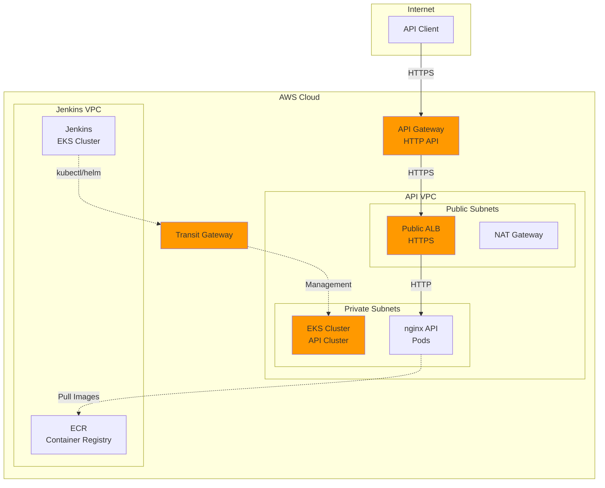

# Design Document: nginx-api-cluster

## Overview

The nginx-api-cluster is a production-ready EKS cluster infrastructure that hosts a REST API application exposed via AWS API Gateway. The system implements a multi-VPC architecture pattern where the API cluster operates independently in its own VPC (10.1.0.0/16) while maintaining connectivity to a Jenkins cluster in a separate VPC (10.0.0.0/16) via AWS Transit Gateway.

The architecture follows AWS best practices for security, scalability, and observability:
- **Public API access** through API Gateway as the single entry point
- **Private compute** with EKS worker nodes in private subnets
- **Cross-VPC management** via Transit Gateway for CI/CD operations
- **Infrastructure as Code** using AWS CDK for reproducible deployments
- **Application deployment** via Helm charts for Kubernetes-native management

### Key Design Decisions

1. **Public ALB instead of VPC Link**: Simplified architecture with API Gateway connecting to a public ALB over HTTPS, secured by security groups that whitelist API Gateway IP ranges. This avoids VPC Link costs while maintaining security through TLS encryption and access controls.

2. **Centralized ECR**: Container images stored in the Jenkins account's ECR, with the API cluster configured for cross-account pulls. This centralizes image management and simplifies the CI/CD pipeline.

3. **Transit Gateway for management**: Enables Jenkins to deploy applications to the API cluster using kubectl/helm commands across VPCs, replicating customer patterns for multi-VPC CI/CD.

4. **Separate CDK stack**: Complete infrastructure isolation from the Jenkins cluster, allowing independent lifecycle management while maintaining connectivity.

## Architecture

### High-Level Architecture Diagram



### Network Architecture

**API VPC (10.1.0.0/16)**:
- **Public Subnets** (2 AZs): 10.1.0.0/24, 10.1.1.0/24
  - Public ALB
  - NAT Gateways
  - Internet Gateway attachment
  
- **Private Subnets** (2 AZs): 10.1.10.0/24, 10.1.11.0/24
  - EKS worker nodes
  - Application pods
  - No direct internet access (via NAT)

**Connectivity**:
- **Internet → API Gateway**: Public HTTPS endpoint
- **API Gateway → ALB**: HTTPS over public internet (secured by security groups)
- **ALB → Pods**: HTTP within VPC
- **Jenkins → API Cluster**: kubectl/helm via Transit Gateway
- **API Cluster → ECR**: HTTPS via NAT Gateway (cross-account)

### Traffic Flow

**API Request Flow**:
1. Client sends HTTPS request to API Gateway public endpoint
2. API Gateway routes to Public ALB DNS over HTTPS
3. ALB security group validates source is API Gateway
4. ALB terminates TLS and routes to backend pods
5. nginx pod processes request and returns response
6. Response flows back through ALB → API Gateway → Client

**Deployment Flow**:
1. Jenkins builds Docker image and pushes to Jenkins account ECR
2. Jenkins executes kubectl/helm command
3. Traffic routes through Transit Gateway to API cluster control plane
4. EKS creates/updates pods with new image reference
5. Pods pull image from Jenkins ECR (cross-account)

## Components and Interfaces

### 1. CDK Infrastructure Stack

**Purpose**: Provision all AWS infrastructure using Infrastructure as Code.

**Components**:
- VPC with public/private subnets across 2 AZs
- EKS cluster with managed node group
- Transit Gateway attachments and route table entries
- API Gateway HTTP API with routes
- IAM roles and policies
- Security groups
- CloudWatch log groups

**Outputs**:
- API Gateway public URL
- EKS cluster name and endpoint
- Kubeconfig for cluster access
- ALB DNS name (after deployment)

**Interface**:
```typescript
class NginxApiClusterStack extends cdk.Stack {
  constructor(scope: Construct, id: string, props: NginxApiClusterStackProps) {
    // props.jenkinsVpcId: VPC ID of Jenkins cluster
    // props.jenkinsAccountId: AWS account ID for ECR access
    // props.transitGatewayId: Existing TGW or create new
  }
  
  // Outputs
  public readonly apiGatewayUrl: string;
  public readonly clusterName: string;
  public readonly albDnsName: string;
}
```

### 2. VPC Module

**Purpose**: Create isolated network infrastructure for the API cluster.

**Configuration**:
- CIDR: 10.1.0.0/16
- 2 Availability Zones
- Public subnets: 10.1.0.0/24, 10.1.1.0/24
- Private subnets: 10.1.10.0/24, 10.1.11.0/24
- 1 Internet Gateway
- 2 NAT Gateways (one per AZ for HA)
- Route tables for public/private routing

**Tagging**:
- Public subnets: `kubernetes.io/role/elb=1` (for ALB)
- Private subnets: `kubernetes.io/role/internal-elb=1` (for internal resources)
- All resources: `kubernetes.io/cluster/<cluster-name>=shared`

### 3. EKS Cluster

**Purpose**: Kubernetes control plane and worker nodes for running containerized applications.

**Configuration**:
- Kubernetes version: 1.28 or latest stable
- Control plane in AWS-managed VPC
- Worker nodes in private subnets (managed by Karpenter)
- No managed node groups (Karpenter provisions nodes dynamically)
- Control plane logging: audit, authenticator, controller manager
- Secrets encryption: AWS KMS

**IAM Roles**:
- **Cluster role**: AmazonEKSClusterPolicy
- **Karpenter node role**: 
  - AmazonEKSWorkerNodePolicy
  - AmazonEKS_CNI_Policy
  - AmazonEC2ContainerRegistryReadOnly (for Jenkins ECR cross-account)
  - AmazonSSMManagedInstanceCore (for node management)
  - Custom policy for cross-account ECR access
- **Karpenter controller role**:
  - EC2 instance management permissions
  - IAM PassRole for node role
  - SQS permissions for interruption handling

**Security Groups**:
- Control plane SG: Allow 443 from Jenkins VPC CIDR
- Node SG: Allow all traffic within cluster, 443 to control plane

### 4. Karpenter

**Purpose**: Dynamic node provisioning and scaling based on pod requirements.

**Installation**: Helm chart from Karpenter repository

**Configuration**:
```yaml
serviceAccount:
  create: true
  name: karpenter
  annotations:
    eks.amazonaws.com/role-arn: <karpenter-controller-iam-role-arn>

settings:
  clusterName: <api-cluster-name>
  clusterEndpoint: <eks-cluster-endpoint>
  defaultInstanceProfile: <karpenter-node-instance-profile>
  interruptionQueue: <karpenter-interruption-queue>

replicas: 2  # HA for controller
```

**IAM Permissions**:
- EC2: RunInstances, TerminateInstances, DescribeInstances
- EC2: CreateFleet, CreateLaunchTemplate, DescribeLaunchTemplates
- IAM: PassRole (for node role)
- SQS: ReceiveMessage, DeleteMessage (for interruption handling)
- Pricing: GetProducts (for cost-aware provisioning)

**Provisioner Configuration**:
```yaml
apiVersion: karpenter.sh/v1alpha5
kind: Provisioner
metadata:
  name: default
spec:
  requirements:
    - key: karpenter.sh/capacity-type
      operator: In
      values: ["on-demand"]
    - key: kubernetes.io/arch
      operator: In
      values: ["amd64"]
    - key: node.kubernetes.io/instance-type
      operator: In
      values: ["t3.medium", "t3.large", "t3a.medium", "t3a.large"]
  
  limits:
    resources:
      cpu: 100
      memory: 100Gi
  
  providerRef:
    name: default
  
  ttlSecondsAfterEmpty: 30
  ttlSecondsUntilExpired: 604800  # 7 days
  
  labels:
    cluster: nginx-api-cluster
  
  taints: []
  
  startupTaints: []

---
apiVersion: karpenter.k8s.aws/v1alpha1
kind: AWSNodeTemplate
metadata:
  name: default
spec:
  subnetSelector:
    karpenter.sh/discovery: nginx-api-cluster
  
  securityGroupSelector:
    karpenter.sh/discovery: nginx-api-cluster
  
  instanceProfile: <karpenter-node-instance-profile>
  
  tags:
    Name: nginx-api-cluster-karpenter-node
    Environment: production
    ManagedBy: karpenter
  
  blockDeviceMappings:
    - deviceName: /dev/xvda
      ebs:
        volumeSize: 20Gi
        volumeType: gp3
        encrypted: true
        deleteOnTermination: true
  
  userData: |
    #!/bin/bash
    /etc/eks/bootstrap.sh nginx-api-cluster
```

**Interruption Handling**:
- SQS queue for EC2 spot interruption notifications
- Karpenter controller watches queue and gracefully drains nodes
- Automatic node replacement before termination

**Scaling Behavior**:
- Provisions nodes within seconds based on pending pods
- Consolidates underutilized nodes to reduce costs
- Respects pod disruption budgets during consolidation
- Supports multiple instance types for better availability

### 5. AWS Load Balancer Controller

**Purpose**: Kubernetes controller that provisions and manages ALBs based on Ingress resources.

**Installation**: Helm chart from EKS repository

**Configuration**:
```yaml
clusterName: <api-cluster-name>
serviceAccount:
  create: true
  name: aws-load-balancer-controller
  annotations:
    eks.amazonaws.com/role-arn: <alb-controller-iam-role-arn>
```

**IAM Policy**: AWSLoadBalancerControllerIAMPolicy (AWS managed)

**Permissions**:
- Create/delete ALBs and Target Groups
- Modify security groups
- Describe VPC resources
- Create/delete tags

### 6. Transit Gateway

**Purpose**: Enable cross-VPC connectivity for Jenkins to manage the API cluster.

**Configuration**:
- Create new TGW or use existing
- Attachments:
  - Jenkins VPC (10.0.0.0/16)
  - API VPC (10.1.0.0/16)
- Route table entries:
  - Jenkins VPC routes: 10.1.0.0/16 → TGW
  - API VPC routes: 10.0.0.0/16 → TGW

**Security**:
- API cluster control plane SG allows 443 from Jenkins VPC CIDR
- No data plane traffic through TGW (only management)

### 7. nginx REST API Application

**Purpose**: Simple REST API for testing API Gateway integration and cross-VPC connectivity.

**Implementation**: nginx with custom configuration serving static JSON responses and echo endpoint.

**Endpoints**:
- `GET /health`: Returns `{"status": "healthy", "timestamp": "<iso8601>"}`
- `GET /api/info`: Returns `{"app": "nginx-api", "version": "1.0.0", "cluster": "<cluster-name>"}`
- `POST /api/echo`: Returns request body with `Content-Type` preserved

**nginx Configuration**:
```nginx
server {
    listen 8080;
    
    location /health {
        default_type application/json;
        return 200 '{"status":"healthy","timestamp":"$time_iso8601"}';
    }
    
    location /api/info {
        default_type application/json;
        return 200 '{"app":"nginx-api","version":"1.0.0","cluster":"$hostname"}';
    }
    
    location /api/echo {
        if ($request_method != POST) {
            return 405;
        }
        proxy_pass http://127.0.0.1:8081;
    }
}

server {
    listen 8081;
    location / {
        return 200 $request_body;
    }
}
```

**Container Image**: Custom nginx image with configuration baked in, stored in Jenkins ECR.

### 8. Kubernetes Resources

**Deployment**:
```yaml
apiVersion: apps/v1
kind: Deployment
metadata:
  name: nginx-api
  namespace: default
spec:
  replicas: 3
  selector:
    matchLabels:
      app: nginx-api
  template:
    metadata:
      labels:
        app: nginx-api
    spec:
      containers:
      - name: nginx
        image: <jenkins-account-id>.dkr.ecr.<region>.amazonaws.com/nginx-api:latest
        ports:
        - containerPort: 8080
        livenessProbe:
          httpGet:
            path: /health
            port: 8080
          initialDelaySeconds: 10
          periodSeconds: 10
        readinessProbe:
          httpGet:
            path: /health
            port: 8080
          initialDelaySeconds: 5
          periodSeconds: 5
        resources:
          requests:
            cpu: 100m
            memory: 128Mi
          limits:
            cpu: 200m
            memory: 256Mi
```

**Service**:
```yaml
apiVersion: v1
kind: Service
metadata:
  name: nginx-api
  namespace: default
spec:
  type: ClusterIP
  selector:
    app: nginx-api
  ports:
  - port: 80
    targetPort: 8080
    protocol: TCP
```

**Ingress**:
```yaml
apiVersion: networking.k8s.io/v1
kind: Ingress
metadata:
  name: nginx-api
  namespace: default
  annotations:
    alb.ingress.kubernetes.io/scheme: internet-facing
    alb.ingress.kubernetes.io/target-type: ip
    alb.ingress.kubernetes.io/healthcheck-path: /health
    alb.ingress.kubernetes.io/listen-ports: '[{"HTTPS":443}]'
    alb.ingress.kubernetes.io/certificate-arn: <acm-certificate-arn>
    alb.ingress.kubernetes.io/security-groups: <alb-security-group-id>
spec:
  ingressClassName: alb
  rules:
  - http:
      paths:
      - path: /
        pathType: Prefix
        backend:
          service:
            name: nginx-api
            port:
              number: 80
```

### 9. Helm Chart

**Purpose**: Package Kubernetes resources for easy deployment and configuration management.

**Chart Structure**:
```
nginx-api-chart/
├── Chart.yaml
├── values.yaml
├── templates/
│   ├── deployment.yaml
│   ├── service.yaml
│   ├── ingress.yaml
│   └── _helpers.tpl
```

**values.yaml**:
```yaml
replicaCount: 3

image:
  repository: <jenkins-account-id>.dkr.ecr.<region>.amazonaws.com/nginx-api
  tag: latest
  pullPolicy: Always

service:
  type: ClusterIP
  port: 80
  targetPort: 8080

ingress:
  enabled: true
  className: alb
  annotations:
    alb.ingress.kubernetes.io/scheme: internet-facing
    alb.ingress.kubernetes.io/target-type: ip
    alb.ingress.kubernetes.io/healthcheck-path: /health
  certificateArn: ""  # Set via --set or override
  securityGroups: ""  # Set via --set or override

resources:
  requests:
    cpu: 100m
    memory: 128Mi
  limits:
    cpu: 200m
    memory: 256Mi

clusterName: ""  # Injected into /api/info response
```

### 10. Public Application Load Balancer

**Purpose**: Internet-facing load balancer that distributes traffic to API pods.

**Configuration**:
- Scheme: internet-facing
- Subnets: Public subnets in both AZs
- Target type: IP (for direct pod routing)
- Protocol: HTTPS (443)
- Health check: GET /health every 10s

**Security Group Rules**:
```
Inbound:
- Port 443 from API Gateway managed prefix list (com.amazonaws.<region>.execute-api)
- Deny all other traffic

Outbound:
- All traffic to VPC CIDR (for pod communication)
```

**TLS Configuration**:
- Certificate: AWS Certificate Manager (ACM) certificate
- SSL Policy: ELBSecurityPolicy-TLS-1-2-2017-01 (minimum TLS 1.2)

**Target Group**:
- Protocol: HTTP
- Port: 8080 (pod container port)
- Health check path: /health
- Healthy threshold: 2
- Unhealthy threshold: 3
- Timeout: 5s
- Interval: 10s

### 11. API Gateway

**Purpose**: Managed API gateway providing public HTTPS endpoint and routing to the ALB.

**Type**: HTTP API (not REST API) for lower latency and cost

**Configuration**:
```typescript
const api = new apigatewayv2.HttpApi(this, 'NginxApi', {
  apiName: 'nginx-api-gateway',
  description: 'Public API Gateway for nginx REST API',
  corsPreflight: {
    allowOrigins: ['*'],
    allowMethods: [apigatewayv2.CorsHttpMethod.GET, apigatewayv2.CorsHttpMethod.POST],
    allowHeaders: ['Content-Type', 'Authorization'],
  },
});
```

**Routes and Integrations**:
```typescript
// HTTP integration to public ALB
const albIntegration = new apigatewayv2_integrations.HttpUrlIntegration(
  'AlbIntegration',
  `https://${albDnsName}`,
  {
    method: apigatewayv2.HttpMethod.ANY,
  }
);

// Routes
api.addRoutes({
  path: '/health',
  methods: [apigatewayv2.HttpMethod.GET],
  integration: albIntegration,
});

api.addRoutes({
  path: '/api/{proxy+}',
  methods: [apigatewayv2.HttpMethod.ANY],
  integration: albIntegration,
});
```

**Stages**:
- Default stage: `$default` (auto-deployed)
- Custom domain: Optional (requires Route53 and ACM certificate)

**Logging**:
- Access logs to CloudWatch Logs
- Log format: JSON with request/response details

## Data Models

### Infrastructure Configuration

**VPC Configuration**:
```typescript
interface VpcConfig {
  cidr: string;              // "10.1.0.0/16"
  availabilityZones: string[]; // ["us-east-1a", "us-east-1b"]
  publicSubnets: string[];   // ["10.1.0.0/24", "10.1.1.0/24"]
  privateSubnets: string[];  // ["10.1.10.0/24", "10.1.11.0/24"]
  natGateways: number;       // 2 (one per AZ)
}
```

**EKS Configuration**:
```typescript
interface EksConfig {
  clusterName: string;
  version: string;           // "1.28"
  karpenter: {
    enabled: boolean;        // true
    version: string;         // "0.32.0"
    instanceTypes: string[]; // ["t3.medium", "t3.large", "t3a.medium", "t3a.large"]
    capacityType: string;    // "on-demand"
    limits: {
      cpu: number;           // 100
      memory: string;        // "100Gi"
    };
  };
  logging: {
    audit: boolean;
    authenticator: boolean;
    controllerManager: boolean;
  };
}
```

**Transit Gateway Configuration**:
```typescript
interface TransitGatewayConfig {
  transitGatewayId?: string;  // Optional: use existing or create new
  attachments: {
    vpcId: string;
    subnetIds: string[];
    routes: {
      destinationCidr: string;
      transitGatewayId: string;
    }[];
  }[];
}
```

### Application Configuration

**API Response Models**:
```typescript
interface HealthResponse {
  status: "healthy" | "unhealthy";
  timestamp: string;  // ISO 8601 format
}

interface InfoResponse {
  app: string;        // "nginx-api"
  version: string;    // "1.0.0"
  cluster: string;    // Hostname/pod name
}

interface EchoResponse {
  // Mirrors request body with same Content-Type
  [key: string]: any;
}
```

### Helm Values Schema

```typescript
interface HelmValues {
  replicaCount: number;
  image: {
    repository: string;
    tag: string;
    pullPolicy: "Always" | "IfNotPresent" | "Never";
  };
  service: {
    type: "ClusterIP";
    port: number;
    targetPort: number;
  };
  ingress: {
    enabled: boolean;
    className: string;
    annotations: Record<string, string>;
    certificateArn: string;
    securityGroups: string;
  };
  resources: {
    requests: {
      cpu: string;
      memory: string;
    };
    limits: {
      cpu: string;
      memory: string;
    };
  };
  clusterName: string;
}
```

### Karpenter Configuration Models

**Provisioner Spec**:
```typescript
interface ProvisionerSpec {
  requirements: {
    key: string;
    operator: "In" | "NotIn" | "Exists" | "DoesNotExist";
    values: string[];
  }[];
  limits: {
    resources: {
      cpu: number;
      memory: string;
    };
  };
  ttlSecondsAfterEmpty: number;
  ttlSecondsUntilExpired: number;
  labels: Record<string, string>;
  taints: {
    key: string;
    value: string;
    effect: "NoSchedule" | "PreferNoSchedule" | "NoExecute";
  }[];
}
```

**AWSNodeTemplate Spec**:
```typescript
interface AWSNodeTemplateSpec {
  subnetSelector: Record<string, string>;
  securityGroupSelector: Record<string, string>;
  instanceProfile: string;
  tags: Record<string, string>;
  blockDeviceMappings: {
    deviceName: string;
    ebs: {
      volumeSize: string;
      volumeType: string;
      encrypted: boolean;
      deleteOnTermination: boolean;
    };
  }[];
  userData: string;
}
```


## Correctness Properties

*A property is a characteristic or behavior that should hold true across all valid executions of a system—essentially, a formal statement about what the system should do. Properties serve as the bridge between human-readable specifications and machine-verifiable correctness guarantees.*

### Property 1: API Gateway Request Forwarding Preservation

*For any* valid HTTP request (with any path, method, headers, query parameters, and body), when sent to API Gateway, the request forwarded to the ALB should preserve all request attributes including path, method, headers, query parameters, and body content.

**Validates: Requirements 6.4, 7.6**

### Property 2: API Gateway Response Forwarding Transparency

*For any* HTTP response returned by the ALB (with any status code, headers, and body), API Gateway should return the response to the client without modification, preserving status code, headers, and body content.

**Validates: Requirements 6.5**

### Property 3: Echo Endpoint Round-Trip Identity

*For any* valid request body sent to POST /api/echo, the response body should be identical to the request body, and the Content-Type header should be preserved.

**Validates: Requirements 4.4**

### Property 4: Health Endpoint Availability

*For any* time the application is running, GET /health should return HTTP 200 with a JSON response containing "status" and "timestamp" fields.

**Validates: Requirements 4.2**

### Property 5: Info Endpoint Metadata Completeness

*For any* time the application is running, GET /api/info should return HTTP 200 with a JSON response containing "app", "version", and "cluster" fields.

**Validates: Requirements 4.3**

## Error Handling

### Infrastructure Provisioning Errors

**CDK Deployment Failures**:
- **Cause**: Resource limits, IAM permissions, or quota issues
- **Handling**: CDK will rollback the stack automatically on failure
- **Recovery**: Review CloudFormation events, fix the issue, and redeploy
- **Prevention**: Use `cdk diff` before deployment to preview changes

**EKS Cluster Creation Failures**:
- **Cause**: Subnet configuration, IAM role issues, or capacity constraints
- **Handling**: CloudFormation will rollback and delete partial resources
- **Recovery**: Check CloudFormation stack events for specific error messages
- **Prevention**: Validate VPC and subnet configuration before deployment

**Transit Gateway Attachment Failures**:
- **Cause**: VPC already attached, route table conflicts, or permission issues
- **Handling**: CDK will fail with descriptive error message
- **Recovery**: Check existing TGW attachments and route tables
- **Prevention**: Use conditional logic to check for existing attachments

### Application Deployment Errors

**Helm Installation Failures**:
- **Cause**: Invalid values, missing dependencies, or resource conflicts
- **Handling**: Helm will report error and leave resources in failed state
- **Recovery**: Run `helm rollback` or fix values and retry
- **Prevention**: Validate values.yaml and use `helm template` to preview

**Image Pull Failures**:
- **Cause**: ECR permissions, network issues, or invalid image reference
- **Handling**: Kubernetes will report ImagePullBackOff status
- **Recovery**: 
  - Verify node IAM role has ECR permissions
  - Check image exists in Jenkins ECR
  - Verify cross-account ECR policy
- **Prevention**: Test ECR access before deployment

**ALB Provisioning Failures**:
- **Cause**: Subnet configuration, security group issues, or quota limits
- **Handling**: ALB Controller will report error in Ingress events
- **Recovery**: Check Ingress annotations and ALB Controller logs
- **Prevention**: Verify subnet tags and security group configuration

### Runtime Errors

**Pod Failures**:
- **Cause**: Application crashes, resource limits, or health check failures
- **Handling**: Kubernetes will restart pods automatically
- **Recovery**: Check pod logs with `kubectl logs`
- **Monitoring**: Set up CloudWatch Container Insights for pod metrics

**ALB Health Check Failures**:
- **Cause**: Application not responding, network issues, or incorrect health check path
- **Handling**: ALB will mark targets as unhealthy and stop routing traffic
- **Recovery**: 
  - Check pod logs for application errors
  - Verify /health endpoint is responding
  - Check security group rules
- **Prevention**: Test health endpoint before deployment

**API Gateway Errors**:
- **Cause**: ALB unreachable, timeout, or invalid response
- **Handling**: API Gateway will return 5xx error to client
- **Recovery**: 
  - Check ALB health and target health
  - Verify security group allows traffic from API Gateway
  - Check API Gateway logs in CloudWatch
- **Monitoring**: Enable API Gateway access logging

### Network Connectivity Errors

**Transit Gateway Routing Failures**:
- **Cause**: Missing route table entries, security group blocks, or TGW attachment issues
- **Handling**: kubectl commands from Jenkins will timeout
- **Recovery**:
  - Verify TGW attachments are active
  - Check route table entries in both VPCs
  - Verify security groups allow port 443
- **Testing**: Use `kubectl get nodes` from Jenkins to verify connectivity

**Cross-Account ECR Access Failures**:
- **Cause**: Missing ECR repository policy or IAM role permissions
- **Handling**: Pods will fail with ImagePullBackOff
- **Recovery**:
  - Add ECR repository policy allowing API cluster account
  - Verify node IAM role has ecr:GetAuthorizationToken permission
  - Check ECR repository exists and image is present
- **Prevention**: Set up ECR policies during infrastructure deployment

### Security Errors

**ALB Security Group Misconfiguration**:
- **Cause**: Security group doesn't allow API Gateway traffic
- **Handling**: API Gateway requests will timeout or be rejected
- **Recovery**: Update security group to allow traffic from API Gateway managed prefix list
- **Prevention**: Use CDK to automatically configure security groups

**TLS Certificate Errors**:
- **Cause**: Expired certificate, wrong domain, or certificate not in ACM
- **Handling**: ALB will fail to provision or clients will see certificate errors
- **Recovery**: 
  - Request new certificate in ACM
  - Update Ingress annotation with new certificate ARN
- **Prevention**: Set up ACM certificate renewal monitoring

## Testing Strategy

### Dual Testing Approach

This feature requires both **unit tests** and **property-based tests** for comprehensive coverage:

- **Unit tests**: Verify specific infrastructure configurations, deployment steps, and integration points
- **Property tests**: Verify universal behaviors across all valid inputs (API forwarding, endpoint responses)

### Unit Testing

**Infrastructure Tests** (using CDK assertions):
- Verify VPC created with correct CIDR and subnets
- Verify EKS cluster created with correct configuration
- Verify Transit Gateway attachments and routes
- Verify IAM roles and policies have correct permissions
- Verify security groups have correct rules
- Verify API Gateway created with correct routes

**Deployment Tests** (using kubectl/helm):
- Verify Helm chart installs successfully
- Verify all Kubernetes resources are created
- Verify pods are running and healthy
- Verify ALB is provisioned with correct configuration
- Verify target groups have healthy targets

**Integration Tests**:
- Verify kubectl works from Jenkins via Transit Gateway
- Verify pods can pull images from Jenkins ECR
- Verify API Gateway can reach ALB
- Verify end-to-end request flow (client → API Gateway → ALB → pod)

**Example Unit Test** (CDK):
```typescript
test('VPC created with correct CIDR', () => {
  const app = new cdk.App();
  const stack = new NginxApiClusterStack(app, 'TestStack', {
    jenkinsVpcId: 'vpc-12345',
    jenkinsAccountId: '123456789012',
  });
  
  const template = Template.fromStack(stack);
  template.hasResourceProperties('AWS::EC2::VPC', {
    CidrBlock: '10.1.0.0/16',
  });
});
```

**Example Integration Test** (bash):
```bash
#!/bin/bash
# Test API Gateway to ALB connectivity

API_URL=$(aws cloudformation describe-stacks \
  --stack-name nginx-api-cluster \
  --query 'Stacks[0].Outputs[?OutputKey==`ApiGatewayUrl`].OutputValue' \
  --output text)

# Test health endpoint
response=$(curl -s -o /dev/null -w "%{http_code}" "$API_URL/health")
if [ "$response" -eq 200 ]; then
  echo "✓ Health endpoint accessible"
else
  echo "✗ Health endpoint failed: $response"
  exit 1
fi
```

### Property-Based Testing

**Property Test Configuration**:
- Library: fast-check (for TypeScript/JavaScript tests)
- Minimum iterations: 100 per property
- Each test tagged with: **Feature: nginx-api-cluster, Property N: [property text]**

**Property Test 1: API Gateway Request Forwarding**
```typescript
import fc from 'fast-check';
import axios from 'axios';

// Feature: nginx-api-cluster, Property 1: API Gateway Request Forwarding Preservation
test('API Gateway preserves request attributes', async () => {
  await fc.assert(
    fc.asyncProperty(
      fc.record({
        path: fc.constantFrom('/health', '/api/info', '/api/echo'),
        method: fc.constantFrom('GET', 'POST'),
        headers: fc.dictionary(fc.string(), fc.string()),
        body: fc.option(fc.jsonValue(), { nil: undefined }),
      }),
      async (request) => {
        // Send request through API Gateway
        const response = await axios({
          method: request.method,
          url: `${API_GATEWAY_URL}${request.path}`,
          headers: request.headers,
          data: request.body,
        });
        
        // For echo endpoint, verify request was forwarded correctly
        if (request.path === '/api/echo' && request.method === 'POST') {
          expect(response.data).toEqual(request.body);
        }
        
        // Verify response is valid
        expect(response.status).toBeGreaterThanOrEqual(200);
        expect(response.status).toBeLessThan(600);
      }
    ),
    { numRuns: 100 }
  );
});
```

**Property Test 2: Echo Endpoint Round-Trip**
```typescript
// Feature: nginx-api-cluster, Property 3: Echo Endpoint Round-Trip Identity
test('Echo endpoint returns request body unchanged', async () => {
  await fc.assert(
    fc.asyncProperty(
      fc.jsonValue(),
      async (body) => {
        const response = await axios.post(
          `${API_GATEWAY_URL}/api/echo`,
          body,
          { headers: { 'Content-Type': 'application/json' } }
        );
        
        expect(response.data).toEqual(body);
        expect(response.headers['content-type']).toContain('application/json');
      }
    ),
    { numRuns: 100 }
  );
});
```

**Property Test 3: Health Endpoint Consistency**
```typescript
// Feature: nginx-api-cluster, Property 4: Health Endpoint Availability
test('Health endpoint always returns valid response', async () => {
  await fc.assert(
    fc.asyncProperty(
      fc.constant(null), // No input needed, just run multiple times
      async () => {
        const response = await axios.get(`${API_GATEWAY_URL}/health`);
        
        expect(response.status).toBe(200);
        expect(response.data).toHaveProperty('status');
        expect(response.data).toHaveProperty('timestamp');
        expect(response.data.status).toBe('healthy');
        expect(new Date(response.data.timestamp).getTime()).toBeGreaterThan(0);
      }
    ),
    { numRuns: 100 }
  );
});
```

### Manual Testing Checklist

**Infrastructure Validation**:
- [ ] VPC created with correct CIDR (10.1.0.0/16)
- [ ] 2 public subnets and 2 private subnets across 2 AZs
- [ ] EKS cluster running with 2+ nodes
- [ ] Transit Gateway attached to both VPCs
- [ ] Route tables configured for cross-VPC traffic
- [ ] API Gateway endpoint accessible from internet

**Application Validation**:
- [ ] Helm chart deploys successfully
- [ ] Pods are running and healthy (3 replicas)
- [ ] ALB provisioned and healthy
- [ ] API Gateway routes to ALB successfully
- [ ] All three endpoints (/health, /api/info, /api/echo) respond correctly

**Cross-VPC Connectivity**:
- [ ] kubectl works from Jenkins pod
- [ ] helm works from Jenkins pod
- [ ] Pods can pull images from Jenkins ECR
- [ ] Jenkins can deploy updates to API cluster

**Security Validation**:
- [ ] ALB only accepts traffic from API Gateway
- [ ] Worker nodes in private subnets only
- [ ] Security groups follow least-privilege
- [ ] TLS termination working on ALB
- [ ] EKS secrets encrypted with KMS

**Monitoring Validation**:
- [ ] EKS control plane logs in CloudWatch
- [ ] ALB access logs in S3
- [ ] API Gateway access logs in CloudWatch
- [ ] Pod logs accessible via kubectl logs
- [ ] Metrics available in CloudWatch Container Insights
